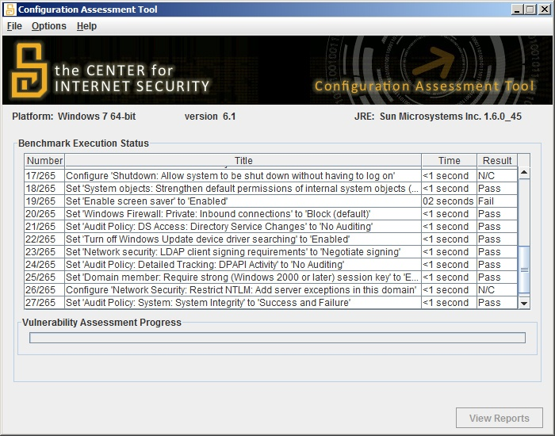
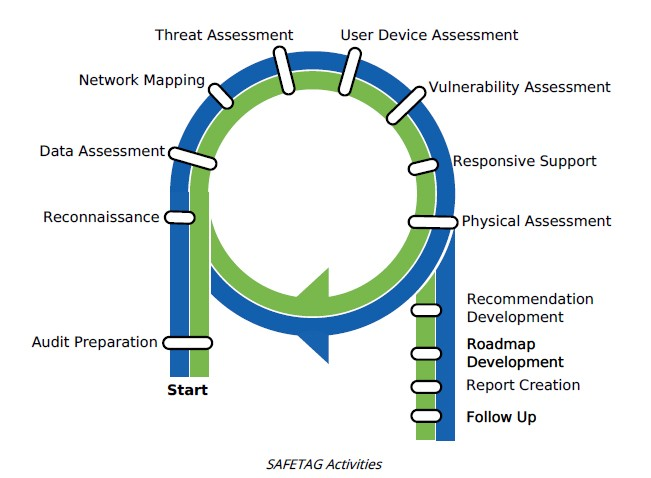

# Basic Audits

### Introduction    

Champions will have been conducting a form of small audit throughout this course with their assessment document. However, there are more established forms of an audit that exist in the information security field. This module is designed to introduce these, as a starting point for them potentially looking to conduct them in future.

### Learning Goals
* Understand how to use the assessment document 
* Understand benching marking tools
* Introduce SAFETAG as the next step if they want to progress in future and conduct full audits

### Assessment Goals
* Add lists of basic tools and resources for basic auditing
* Add basic list of regular checks and "mini-audit" that they will do on a regular cycle

### Recommend Preparations
* Download and test CIS-Cat lite
* Be familiar with SAFETAG
* Familiarity with Nessus, OpenVas or Nexpose etc may be helpful

### Suggested Time
30 mins

### Notes
N/A

## Activity
***Running a benchmarking***

Ask participants to download and run benchmarking tool. 

  
*Screenshot of CIS-CAT Lite performing an audit of Windows 7*

We suggest the use of [CIS-CAT Lite](https://www.cisecurity.org) as it is free, very simple, cross-platform tool that individuals can use to quickly assess the security of the configuration on the devices they are using.

As participants to record on post-it notes the score that they get.
    
## Discussion 
* What assets do we have in the training room?
* How can we keep track of them?
* What basic standards do we expect to meet?
* What standard of information security do we know about?
* How many of us have used these standards?
* How can we measure our standards?
* What scores did our devices get on the benchmark test?
* What configuration problems were the most common?
* How comfortable would we feel to fix the main problems that have been identified?

## Inputs 
There are a number of different types of standard, developed by multiple organisations that may apply or be used for the work that Champions do.

For example:    

* Centre for Internet Security (CIS)
* International Organization for Standardization (ISO)
* National Institute of Standards and Technology (NIST)
* Open Web Application Security Project (OWASP) 
* Payment Card Industry (PCI)
* Security Auditing Framework and Evaluation Template for Advocacy Groups (SAFETAG)

Each of these standards addresses different issues and works in different ways. For example some of them:

* Focus on device and networks, others on processes or websites, and applications. 
* Can be more automated and can be mostly conducted with specific tools.  
* Need a lot of human inputs but gather a more comprehensive picture of an organisation
* Require a specific auditor be trained for an audit to be official
* Can take a significant amount of time, cost and resources to fully conduct

## Deepening
***Other types of auditing***
There a number of different types of tools and techniques that can be used for helping conduct audits of organisations.

These include:

* Mapping Tools - such as NMAP, Angry IP Scanner
* Vulnerability Scanners - such as Nessus, Nexpose and Openvas.
* Vulnerability Exploit Tools - such as Metasploit, Immunity Canvas
* Configuration Benchmarking Tools - such as CIS-CAT, Openscap, Microsoft Security Compliance Manager
* Inventory and Asset Managers - Snipe-IT, Open-AudIT

***SAFETAG***   
Developed by Internews, SAFETAG is a standard specifically designed for meeting the unique needs of the civil society community. It covers how to conduct a full audit of an organisation and is flexible to deal with the technical capabilities and risks that they groups may face. However, it does require being comfortable with a number of tools and processes. 

For many Champions on this course who implement the basic assessment they create, SAFETAG would be an excellent training and auditing goal for themselves and their organisations.

   
*The SAFETAG audit framework*

## Synthesis
Participants should turn to their assessment documentation and consider how their organisation deals with the subject matter covered in this module. Where necessary they should ask questions and work with other participants to identify any:
 
* Issues they have found that affect their organisations
* Possible solutions they have learned
* Possible difficulties they may face in implementation (ideally using the time and experience of trainers and other participants)
* Things would need to overcome these difficulties
* Connections to other organisations or individuals that would help them
* Timeline, resources and costs for implementation

This should be noted in their assessment, for future use. 

In line with keeping this curriculum as an updated community tool, we would also ask that participants provide comments, feedback and new ideas for this module on the project website and/or Github!
 
## Resources

