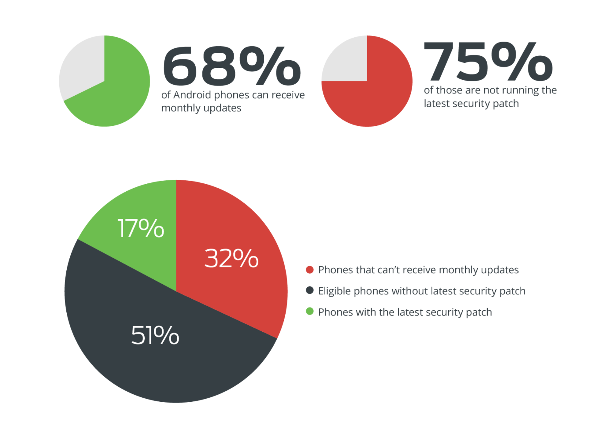
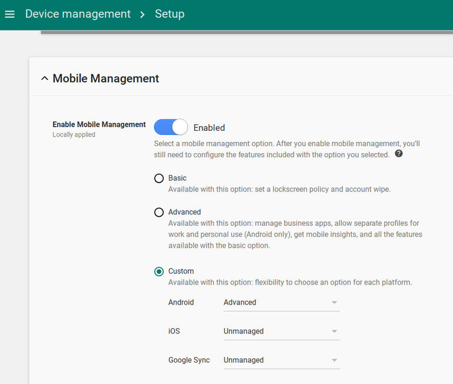
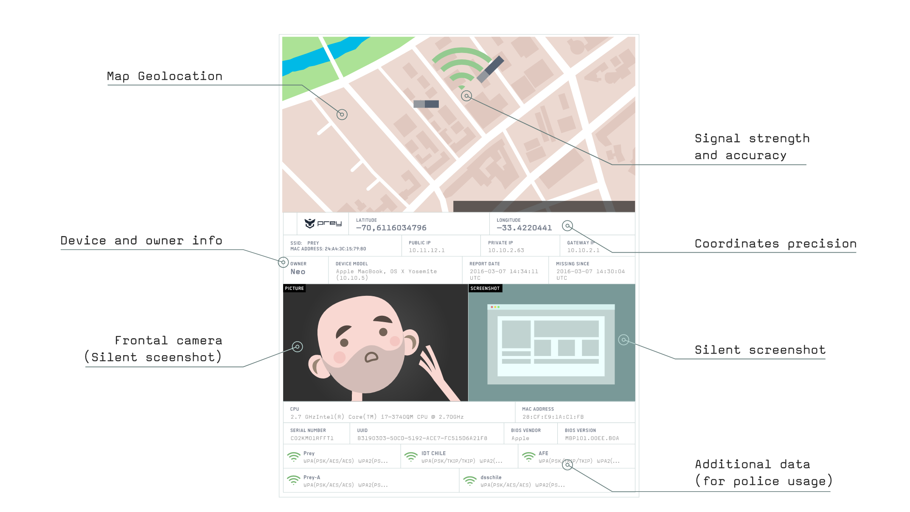

# Mobile Device Management / Bring Your Own Device

### Introduction
Mobile devices are now an essential part of our work and personal life. Individuals generally expect to be able to use their own chosen devices. This is often good as it raises productivity, allows flexibility and reduces the organisation's costs for purchasing equipment.

However managing mobile devices securely is complex. They have as much, if not more data about us than our computers do, however they are even more vulnerable. They can be lost, stolen, affected by malware and many of them (especially Android) lack security precautions such as regular updates. 

This module aims to introduce some simple tools and methodologies for managing mobile devices in an organisation. 

### Learning Goals
* Understand positives/negatives of MDM / BOYD policies
* Exam some common options for simple MDM within an organisation

### Assessment Goals
* Add template for MDM/BYOD in their organisation
* Have identified and tested a solution for MDM/BYOD if relevant to their organisation### Recommend Preparations

### Recommend Preparations  
Print off copies of example BYOD/MDM policies.

It is recommended that the trainer have already prior experience setting up at least one or two of the MDM/BYOD tools. Where possible it makes sense to have training account that can be used during the module.

### Suggested Time

30 Minutes

### Notes
N/A

## Activity    
N/A

## Discussion  
* What devices are used within the participant's organisations?
* What devices are within the room?
* What are the dangers of having multiple types of devices with access to sensitive information in an organisation? (e.g. lack of encryption, poor Android update infrastructure, hard to manage)
* What have been the participant's problems with managing multiple devices in their organisation?
* What systems, if any have been used?
* What have been the advantages and disadvantages of the tools used?

## Inputs  
***Policies***

MDM or BYOD comprises of both internal policies and technical solutions.

Provide participants with example templates of a MDM/BYOD policy and ask them to critique it within their own organisations. What would they use? What would they need to add in? How could it be implemented?

Example Templates include:

* https://cp.labtechsoftware.com/assets/marketing_materials/pdf/mobility_byod_policy.pdf
* http://www.code3pse.com/public/media/22845.pdf
* https://cdn2.hubspot.net/hub/445439/file-2042247754-pdf/images/Sample-BYOD-Policy-Template.pdf
* http://www.itmanagerdaily.com/byod-policy-template/
* http://www.webtorials.com/main/resource/papers/fiberlink/paper2/MDM_Policies_Best_Practices_Guide.pdf

***Android***   
While the variety of mobile devices available precludes spending much time discussing the merits of each. It is worth highlighting the risks caused by the fragmentation of the Android device ecosystems. A significant amount of Android devices do not receive the latest security updates and thus are very vulnerable to previously patched security holes. This is particularly problematic for individuals with older Android devices.

Source: [Thirty Percent of Android Devices Susceptible to 24 Critical Vulnerabilities](https://duo.com/blog/thirty-percent-of-android-devices-susceptible-to-24-critical-vulnerabilities)

For more information:

* [The State of Android Software Updates 2017](https://www.miradore.com/blog/the-state-of-android-software-updates-2017/)
* [Android Security Bulletin](https://source.android.com/security/bulletin/)

## Deepening   

Test the usage of at least one of the MDM/BYOD services with the devices within the room.

* [Google G-Suite](https://www.google.com/non-profits/)
* [Microsoft Office 365] (https://support.office.com/en-i.e./article/Capabilities-of-built-in-Mobile-Device-Management-for-Office-365-a1da44e5-7475-4992-be91-9ccec25905b0)
* [Microsoft Intune](https://www.microsoft.com/en-ie/cloud-platform/microsoft-intune)
* [Prey - open source tool](https://www.preyproject.com)
* [Miradore - paid but has free and self hosted version] (https://www.miradore.com)
* [Packet Fence](https://packetfence.org)
* [VMWare Airwatch - has free trial](https://www.air-watch.com)

 

*Example of the features in G-Suite*

*Example of the features in Prey Project - an open source tool with some limited MDM/BYOD capability*

Ask participants to feedback on issues such as:

* Easiness of setup and deployment
* Features
* Security 
* Cost
* Advantages and disadvantages

What other open source tools or those available at low cost from [Techsoup](http://www.techsoup.org) can be utilised?

## Synthesis   
Participants should turn to their assessment documentation and consider how their organisation deals with the subject matter covered in this module. Where necessary they should ask questions and work with other participants to identify any:
 
* Issues they have found that affect their organisations
* Possible solutions they have learned
* Possible difficulties they may face in implementation (ideally using the time and experience of trainers and other participants)
* Things would need to overcome these difficulties
* Connections to other organisations or individuals that would help them
* Timeline, resources and costs for implementation

This should be noted in their assessment, for future use. 

In line with keeping this curriculum as an updated community tool, we would also ask that participants provide comments, feedback and new ideas for this module on the project website and/or Github!

## Resources
* [Microsoft: Set up Mobile Device Management (MDM) in Office 365](https://support.office.com/en-ie/article/Set-up-Mobile-Device-Management-MDM-in-Office-365-dd892318-bc44-4eb1-af00-9db5430be3cd)
* [NIST: "User’s Guide to Telework and Bring Your Own Device Security"](http://nvlpubs.nist.gov/nistpubs/SpecialPublications/NIST.SP.800-114r1.pdf)
* [UK National Cyber Security Centre: "End User Device Security Collection"](https://www.ncsc.gov.uk/guidance/end-user-device-security)
* [UK Government BYOD Guidance](https://www.gov.uk/government/publications/byod-guidance-executive-summary/byod-guidance-executive-summary)