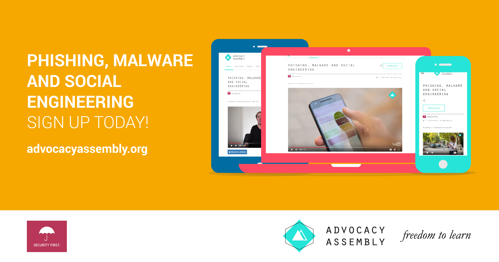
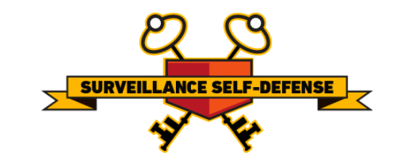
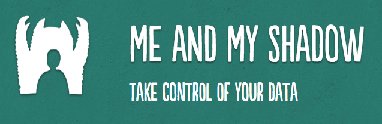
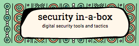
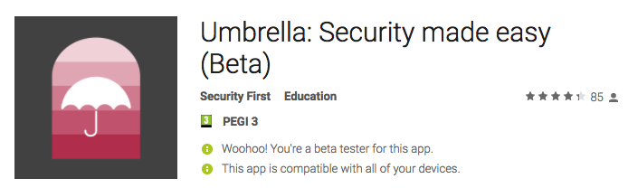

# User Education

### Introduction
Many champions will have already have had previous experience training individuals in their own organisations. This module and course are not designed to train trainers (there are many resources such as [Level-Up](https://www.level-up.cc) that already do this well), instead, it is an opportunity to explore some of the tools that are available and to share best practices for integrating user education into organisaions.

### Learning Goals
* Help participants learn about current initiatives for peer education and training
* Participants share and critique various resources for peer education and training
* Participants share experiences and best practices on peer education 

### Assessment Goals
* Develop measures and plans to integrate user education and training into work of their organisations

### Recommend Preparations
N/A

### Suggested Time
30 mins

### Notes

## Activity
N/A

Trainer Note: While this course is not a training of trainer course, it might become relevant for participants to use this opportunity to test and benchmark their own user education efforts. If so, one activity that could be useful is asking participants to prepare a short five/ten-minute presentation and deliver it to the group. The group would then be asked to provide feedback on delivery, message and feedback - as if they were people receiving the training within the individual's organisation for the first time. 
 
## Discussion 
Using a flip-chart or other medium, break up participants into groups and ask them to answer and document questions such as the following:

* Why do we do user education?
* What are our own experiences of delivering user education?
* What topics do we cover?
* How do we deliver user education?
* What tools and resources do we use for user education? Why? Which tools are the most useful? Which does are the most up-to-date?
* What tools and resources do we not currently have that would help us in user education?
* How long do we take to deliver user education?
* What have been our positive/negative experiences when delivering user education?
* How do we measure success or failure in user education?
* What methods help us increase success in user education?
* How do we measure success or failure in implementation?

## Inputs 
N/A

There are a number of tools available for validating user education initiatives.

For example:

* Testing understanding and implementation of advice on phishing

There are also a number of tools available for measuring progress in user education courses. A number of these can be self-hosted. 

 
## Deepening 

  
## Synthesis
Participants should turn to their assessment documentation and consider how their organisation deals with the subject matter covered in this module. Where necessary they should ask questions and work with other participants to identify any:
 
* Issues they have found that affect their organisations
* Possible solutions they have learned
* Possible difficulties they may face in implementation (ideally using the time and experience of trainers and other participants)
* Things would need to overcome these difficulties
* Connections to other organisations or individuals that would help them
* Timeline, resources and costs for implementation

This should be noted in their assessment, for future use. 

In line with keeping this curriculum as an updated community tool, we would also ask that participants provide comments, feedback and new ideas for this module on the project website and/or Github!

## Resources
* [Level-Up](https://level-up.cc/)
* [My Shadow](https://myshadow.org/)
* [NIST: National Initiative for Cybersecurity Education](http://nvlpubs.nist.gov/nistpubs/SpecialPublications/NIST.SP.800-181.pdf)
* [Guide for System Administrators in At‐Risk Organizations: Physical Security](https://github.com/OpenInternet/System_Administrator_Guide_Text/blob/master/en/best_practices/staff_awareness_and_communications/index.md)
* Digital Security Diagnostics for Civil Society Organizations: A guide for facilitators

