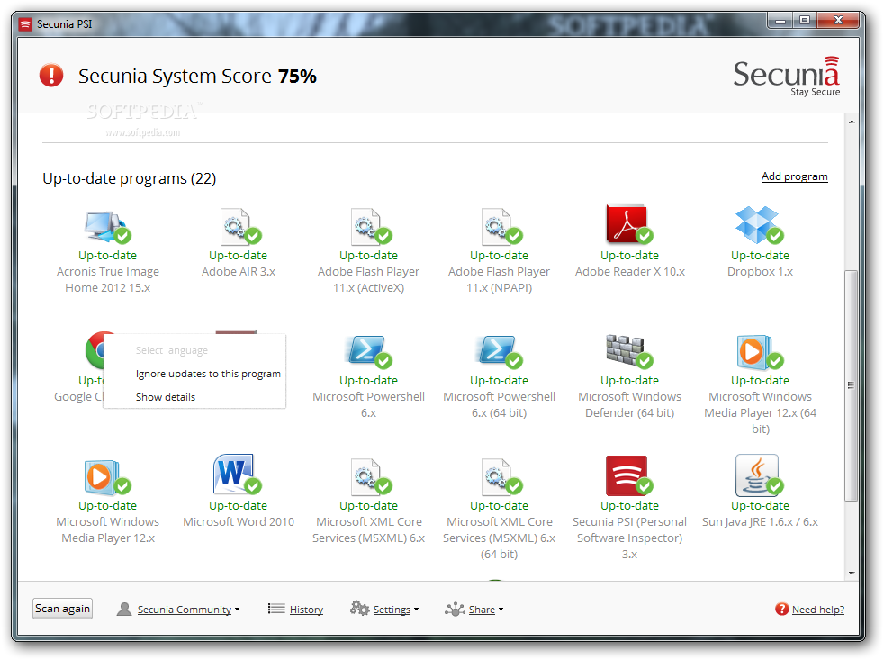
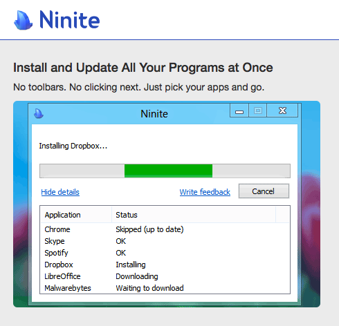
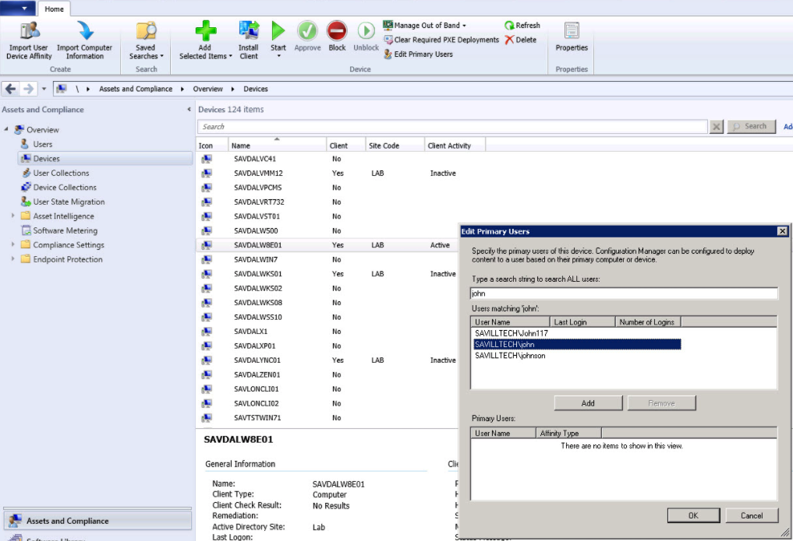

# Encryption, Patching, Licensing

### Introduction
The aim of this module is to help champions learn methods for managing some of the most important methods for mitigating their organisations risk with digital devices.

### Learning Goals
* Understand the need for and types of encryption available on devices
* Knowledge of the various systems for managing encryption, patching and licensing

### Assessment Goals

* Add the current status of encryption, patching and licensing across their organisation
* Established relationship if necessary with provider such as TechSoup who can provide discount
* Added rough costing of any new software or service to their development plan

### Recommend Preparations  
N/A

### Suggested Time  
45 mins

### Notes   
N/A

## Activity 
Ask participants to list the types of devices that they currently have on them. Usually this will result in a mix of devices: Android phones of various brands, different types of laptop, iOS devices, tablets etc. Divide participants into smaller groups with a mixture of devices within each group. 

On a flipchart or with post-its, ask participants to list their devices. 

Ask them list the device, then

* If they have full disk encryption turned on
 
* The current level of operating system and security update level and/or licence being used by it. For example, an old laptop may be running Windows XP and last had an update in 2014. A new iPhone may have had the latest version of iOS installed and an old Android phone may not have been receiving security updates. 

Participants then search for known vulnerabilities in each of the devices listed using a website such as https://www.cvedetails.com or https://www.rapid7.com/db/modules/. Beside each operating system, if they find a vulnerability they should briefly describe what the vulnerability is. 

If time allows, the same process can also be done for specifically common pieces of software, such as Chrome, Firefox, Java, Adobe or Microsoft Office.

Using data on most vulnerable software, ask participants to list which other pieces of software they or their organisation might be vulnerable to (for example: https://www.flexerasoftware.com/enterprise/resources/research/country-reports/)
   
## Discussion  
Bring participants back into plenary session and ask them:
        
* What do they see as the benefits/disadvantages to full disk encryption?
* What has been their experiences when implementing it personally? Within their organisations?
* What way do they/their organisations manage patching and licensing in their organisations?
* What problems have they had with managing patching and licensing in their organisations? (e.g. scale, distribution, multiple systems, cost)
* What methods, systems or software have they used to manage patching and licensing? 

## Inputs  
There are many systems available for managing patching and licensing for organisations. Each of them has very different pros/cons. For this part of the module, participants will break into groups and experiment with a number of systems for managing patching and licensing.

Each group will be given at least one free, open source and/or cheap update/package manager and asked to test it on their devices. They will then be asked to decide record information based on the following headings:

* Ease of use
* Advantages
* Disadvantages (including which pieces of software are covered)
* Security
* Deployability in their own organisation

*Screenshot of Secunia Personal Software Inspector*

Useful Tools

* For managing Windows Products - Secunia PSI -https://www.flexerasoftware.com/enterprise/products/software-vulnerability-management/personal-software-inspector/
* For managing Windows Products - Ninite - https://ninite.com
* For managing Windows Products - Chocolatey -https://chocolatey.org
* For managing Apple OS X Products - https://www.munki.org/munki/

    
*Screenshot of Secunia Personal Software Inspector*

The above tools have been chosen because of their ease of use, low cost and simplicity to show in a short training environment. We suggest  soliciting other tools that may already be used by participants and/or letting groups research other tools that they may wish to test and discuss. We have chosen some of the following as they are widespread, have trial versions or have non-profit discounts through programs such as TechSoup.  Some others that may be useful include:


*Screenshot of Micorosft System Centre Configuration Manager*

* Microsoft System Centre Configuration Manager - SCCM - https://www.microsoft.com/en-US/cloud-platform/system-centre-configuration-manager
* GFI LanGuard - https://www.gfi.com/products-and-solutions/network-security-solutions/gfi-languard

Trainer Note: Highlight available tools and discounts with organisations such as TechSoup. 

Each group should feedback on the product(s) that they tested.

## Deepening   
Integrating into their organisations.

Following the previous discussion on software tools available to help manage deployment of software within an organisation. Ask individuals to break into groups depending on the type of software they believe is most relevant to them and then to create a plan for integrating the software into their organisation. It Should include topics such as:

* How many devices will it need to cover?
* How long would it take to implement?
* What costs would it take?
* What implementation problems might occur? How can these be overcome?

When individuals within the group reach a consensus, they should then add the plan to their own organisational assessments.

## Synthesis   
Participants should turn to their assessment documentation and consider how their organisation deals with the subject matter covered in this module. Where necessary they should ask questions and work with other participants to identify any:
 
* Issues they have found that effect their organisations
* Possible solutions they have learned
* Possible difficulties they may face in implementation (ideally using the time ad experience of trainers and other participants)
* Things would need to overcome these difficulties
* Connections to other organisations or individuals that would help them
* Timeline, resources and costs for implementation

This should be noted in their assessment, for future use. 

In line with keeping this curriculum as an updated community tool, we would also ask that participants provide comments, feedback and new ideas for this module on the project website and/or Github!

## Resources
* [Level-Up "Safer Software Updating](https://level-up.cc/curriculum/malware-protection/safer-software-updating/)
* [SAFETAG "Network Mapping," p.69](https://safetag.org)

