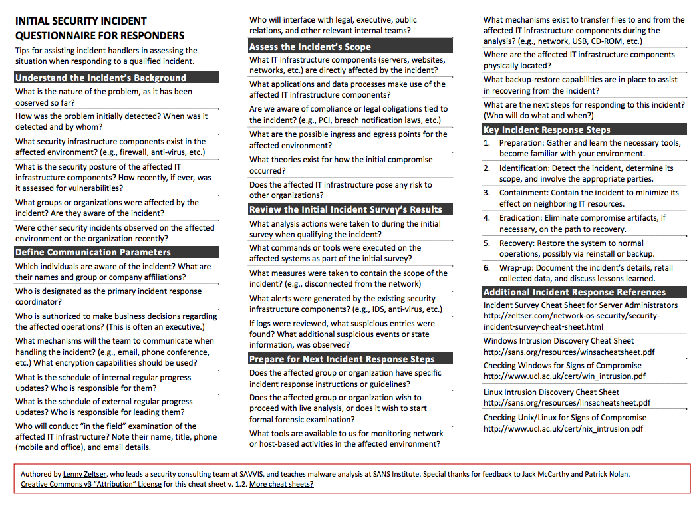

# Responding to Incidents

### Introduction
Dealing with incidents once they have occurred is an important part in mitigating the effect of overall risks within an organisation. Champions within civil society groups must deal with everything from lost phones to sophisticated government attackers. This module highlights some services that can be utilised in the event of incidents occuring and also some useful references that can be used for helping champions prepare and respond to incidents.

### Learning Goals
* Understand commons information security problems effecting civil society groups
* Understand frameworks for dealing with information security incidents
* Explain first line response procedures for potential incidents
* Describe the different offerings of various groups who can help - timescale, resources etc.
* Understand what is needed for forensic analysis at a later point


### Assessment Goals
Add incident response plan for major information security risks to the assessment

### Recommend Preparations
N/A

### Suggested Time

45 Minues

### Notes
N/A

## Activity   
**Incident Simulations**    
Break participants into two groups. Each will be given a different scenario. 

***Scenario One***
A hacking group hostile to your organisation has sent out a tweet with screenshots of a few sensitive internal files containing information on the pay and personal details of a few of the staff. They say this is just the beginning and they have access to lots more. What will you do?

***Scenario Two***
A colleague of yours in travelling for the past week in a high risk country to gather sensitive evidence from witnesses about human rights abuses in a country. They recently called you to say they were arrested by intelligence officials of the local government on the way to the airport. They could not say any more. You can assume they have all of their sensitive information and devices with them. What will you do?

Trainers Note: It is often most productive to assign specific roles to individuals within the groups themselves, in order to stimulate discussion and also to ensure that a variety of viewpoints are being represented. Experience shows that people often under estimated who is involved in responding to incidents and how much of their time and resources are necessary. For example, in scenario two, some of the roles could include people such as:

* IT Champion
* Organisational Director
* Social Media or Public Relations Manager
* Family of the staff member
* Individual who provided testimony and is now concerned
* Finance team
* Embassy representative of the person detained
* Government representative of the person detained or of the country which detained the individual
* Google/Facebook/Cloud host Representative (if the group decides they want to have )    
 
## Discussion  
* What lessons did we learn from the scenarios?
* What did we think we handled well?
* What did we think we did not handle well?
* How could we make ourselves better prepared to deal with incidents?
* Who might be involved with responding to incidents in our own organisations?
* What sort of incidents do we think this process would be useful in helping us address?

## Inputs  
There are a number of sources of support for civil society groups when they experience a digital security incident.

These include organisations such as:

* [Access Now](https://www.accessnow.org/) 
* [Security without Borders](https://www.securitywithoutborders.org/)
* [Digital Security First Aid Kit](https://www.digitaldefenders.org/digitalfirstaid/)
* [Security First](https://www.secfirst.org)

## Deepening   
Paticipants will now break into groups to conduct discussions where they review best practice documentation on how to respond to incidents. The should examine each document and discuss points such as:    
-How useful is the document?    
-Do the understand everything I would need to be able to use it correctly?  
-What would the need to add, remove or modify to make it useful for themselves?   

Examples of basic incident reponse documentation include:

* [Lenny Zelstser's "Initial Security Incident Questionnaire for Responders - example above](https://zeltser.com/security-incident-questionnaire-cheat-sheet/)
* [SANS Incident Handler's Handbook](https://www.sans.org/reading-room/whitepapers/incident/incident-handlers-handbook-33901)
* [OWASP Top 10 Considerations For Incident Response](https://www.owasp.org/index.php/OWASP_Incident_Response_Project) 
* [OWASP Anti-Ransomware Guide](https://www.owasp.org/images/4/4a/Anti-RansomwareGuidev1-5.pdf) 
 

## Synthesis 
Participants should turn to their assessment documentation and consider how their organisation deals with the subject matter covered in this module. Where necessary they should ask questions and work with other participants to identify any:
 
* Issues they have found that effect their organisations
* Possible solutions they have learned
* Possible difficulties they may face in implementation (ideally using the time ad experience of trainers and other participants)
* Things would need to overcome these difficulties
* Connections to other organisations or individuals that would help them
* Timeline, resources and costs for implementation

This should be noted in their assessment, for future use. 

In line with keeping this curriculum as an updated community tool, we would also ask that participants provide comments, feedback and new ideas for this module on the project website and/or Github!

TODO    
-Conduct a series of short scenarios games based on the most likely threats risks faced by the participants in the training.
-Emphasis the need for threat information sharing. Suggest methods for doing that (procedural - NDA etc.) and technical (IOC, MISP etc.)  

## Resources