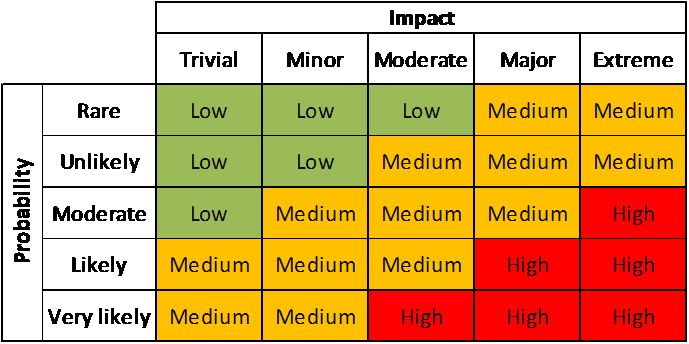
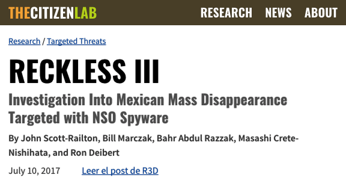
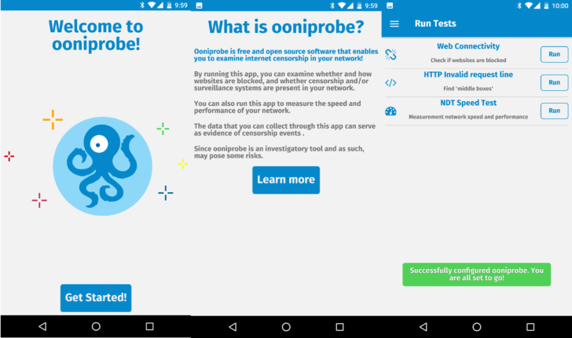
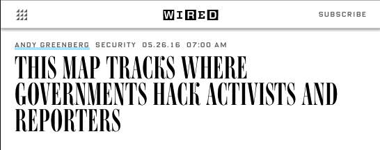
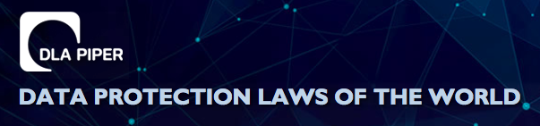
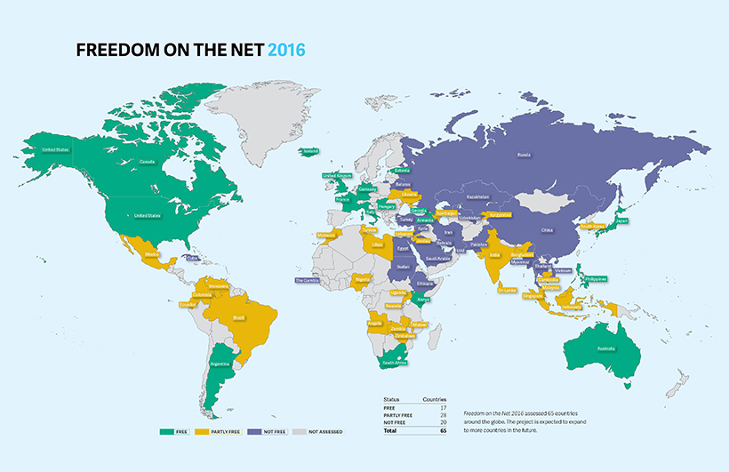
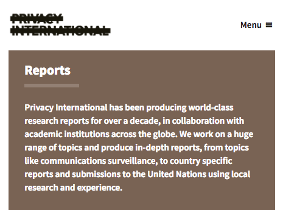
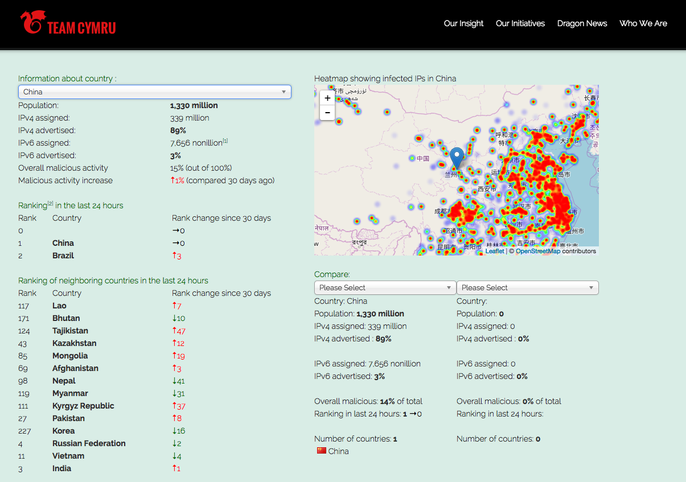

# Mapping information, conducting threat modelling and managing risk

### Introduction
Providing effective information security is often a delicate balance. Threats can often be varied and information about them can be confusing or incomplete. Resources are also limited, so organisations need to concentrate on dealing with risk in the most effective way that they can. 

This module provides a starting point for the course and to create a framework for thinking and addressing choices made in other modules.

### Learning Goals

* Understand what information (both digital and physical) that they use in their work, where it is stored, who has access to it, who might want to access it and how to map it out
* Have a clear understanding of the differences between likelihood, impact, risk and mitigation
* Have located and utilised resources for understanding and accessing their own threat environment
* Understand the challenge of creating an effective information security policy within an organisation

### Assessment Goals
* Have created an information map for their organisation
* Add generic and localised threat resources (where available) to their threat assessment
* Have divided their information into easily understandable traffic light map with corresponding mitigation measures

### Recommend Preparations
* Mapping is best done physically using flip charts and/or post-it notes
* Participants should have access to secure wifi
* It may be useful for having a shared hackpad or another document that will allow participants to ensure any new resources that they may find.
* It is helpful for the trainer to have already had an understanding of any localised threats already faced within the countries and/or organisations that the participants are from. In the "Deepening" section, a number of case studies should be selected. Ideally, these will have public information already known about them (e.g media reports), so that the participants will be able to research the topics and make recommendations themselves. It is suggested to use some of the locations in the "Resources" section for this.

### Suggested Time

75 Minutes  

### Notes
* Occasionally the participants in this module may end up driving the conversation into being completely being about digital information. It is important to ensure that participants also consider physical information - including things such as the storage of paper files, secure disposal of sensitive waste, the importance of caution in physical conversations etc.

## Activity

Break participants into groups, provide them with a flipchart and/or post-it notes and ask them to ask to answer the following questions. 

Where possible, each answer should be scaled from most to least sensitive etc.

* What information does their organisation store?
* Where do they store that information?
* Who has access to that information?
* Why do they have access to that information?
* What adversaries may wish to access that information?
* How might an adversary access that information?
* What mitigation measures can we take to protect that information?

The participant should then record the information on their own assessment sheet or document.
    
## Discussion  
* What information security breaches or threats have we experienced or heard about? 
* How did we react to those information security breaches?
* How do we think we would react to those information security breaches?
* What security policies do we have in place already? 
* What problems have we seen with the implementation of security policies?
* How might we overcome these implementation policies?
* What sources of information do we use for keeping up-to-date on security threats? 

## Inputs  

The trainer should demonstrate a simplified version of how to access risk. 

Risk is the likelihood that something will happen multiplied by the impact if that it does happen. This concept can often be confusing to be people addressing it for the first time, especially if a trainer attempts to immediately attach numbers to each part. One way to make it easier to understand initially is by drawing a horizontal and then vertical line at a 90-degree angle, like a two-sided triangle. Name one line "likelihood" and the other "impact." 

Participants should then each be given a post-it note, asked to think of an information security risk and then place it on the chart depending on where they think the risk should fit before any mitigation measures are taken. They should then be asked to name some mitigation measures and then move the post-it note to where they think it should be after implementing them. 

The objective of this activity is to ensure a participant realises that risk by reducing by either or both reducing likelihood or reducing impact. Often people tasked with managing risk tend to concentrate on only one of these two factors.

If the participants feel comfortable with the concept the trainer can then introduce more formalised ways of measuring risk, such as a simplified "risk register." The trainer should demonstrate how to fill out a register using a couple of examples. If they are using numbers (1 to 5) or levels ("Low, Medium or High") to measure likelihood etc, it is useful to ask the participants to provide their opinion and then select the average. This technique helps ensure that risk registers suffer less from individual biases.  

Individuals can now start to add topics they feel are specific risks to them into the risk register but we will wait until the "Deepening" to start looking at measuring the risks through threat modelling.

## Deepening

### Threat Modelling Reseach

This section focuses on participants on researching information security threats that already have occurred in countries or within organisations similar to their own. From this, they will have to make assessments of the mitigations that they would need to take to reduce any potential similar risks.

* On a flipchart, ask participants what resources they use for keeping up-to-date on information security issues. An example would be reports by Citizen Lab.
* Ask them to provide an opinion on the usefulness of each of the resources that they mention. Including topics such as:
    * How up-to-date they are
    * How easy they are to read, understand and draw information from
    * How applicable they are to the context of the participants
    * What languages they are in  
    * Other useful information
* Ask participants what well-known information threats they are aware of that have affected organisations similar to their own. 

The group will be broken down into teams and asked to use the suggested (or other) resources they have collected to go out and research an information security threat that is relevant to their work. They will be asked to report back on the threat addressing such issues as:

* What was the threat?
* Who did it effect?
* Why were they targeting?
* How did it affect the individuals or organisations?
* How could the likelihood be mitigated?
* How could the impact be mitigated?
* What residual risk would the participants face if they were targeted by this method?   

For example: In July 2017 Citizen Lab reported that a group of investigators into mass disappearances in Mexico were targeted with spyware developed by the NSO Group. Participants could be asked to research this case study with available resources and then propose mitigation measures.

Source: "Reckless III: Investigation Into Mexican Mass Disappearance Targeted with NSO Spyware" 
https://citizenlab.ca/2017/07/mexico-disappearances-nso/

Trainer Note:   

* It may not be possible to find case studies that closely match the profile of the participants in the room. In that case, it can often make sense to open the research to include regional threats, as often trends are likely to spread.
* If a participant was involved in one of the cases being research, it may make sense to have them not involved in the research on it, instead have another group research on it, provide their recommended solutions and then use the knowledge of the individual to add to the debrief. 

## Synthesis   
Participants should turn to their assessment documentation and consider how their organisation deals with the subject matter covered in this module. Where necessary they should ask questions and work with other participants to identify any:
 
* Issues they have found that affect their organisations
* Possible solutions they have learned
* Possible difficulties they may face in implementation (ideally using the time and experience of trainers and other participants)
* Things would need to overcome these difficulties
* Connections to other organisations or individuals that would help them
* Timeline, resources and costs for implementation

This should be noted in their assessment, for future use. 

In line with keeping this curriculum as an updated community tool, we would also ask that participants provide comments, feedback and new ideas for this module on the project website and/or Github!

TODO:
- add 

## Resources
* [Botherder's list of reports detailing digital attacks on Civil Society](https://github.com/botherder/targetedthreats/wiki/Reports)
* [Citizen Lab](https://citizenlab.ca)
* [Open Observatory of Network Interference](https://ooni.torproject.org/)
* [OpenNet Initiative](https://opennet.net/)
* ["Fredom on the Net" Annual Reports by Freedom House](https://freedomhouse.org/report-types/freedom-net)
* [SAFETAG Full Guide: "Risk Assessment and Analysis," Page 10](https://safetag.org)
* [SAFETAG Full Guide: "Context Research," Page 27](https://safetag.org)