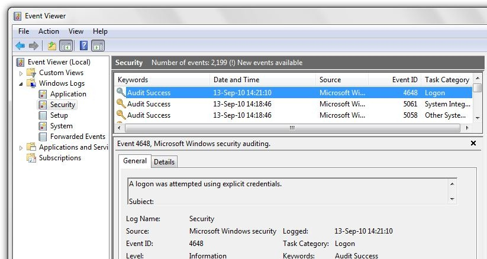
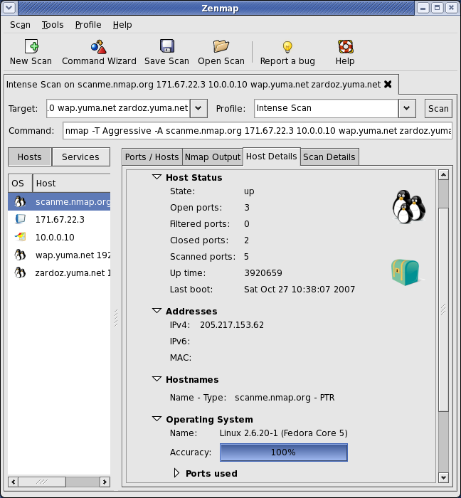
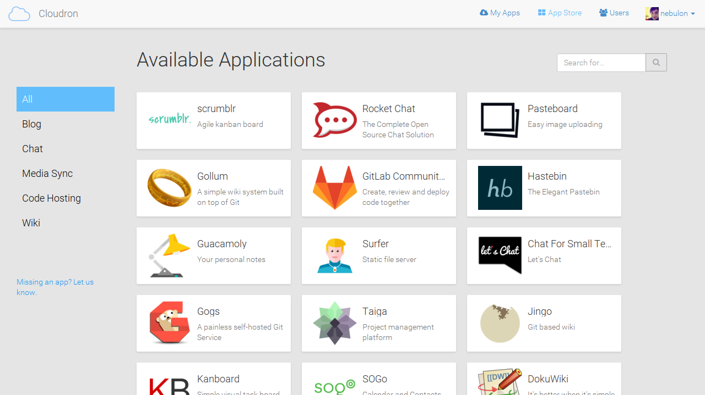
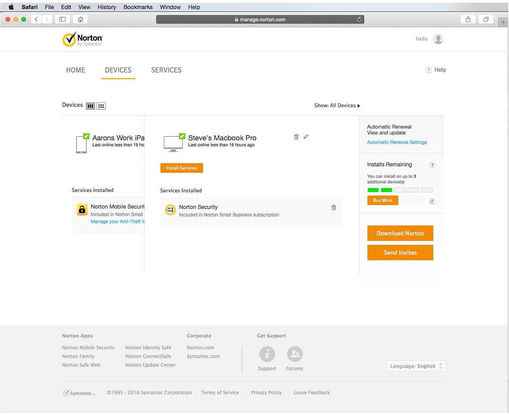
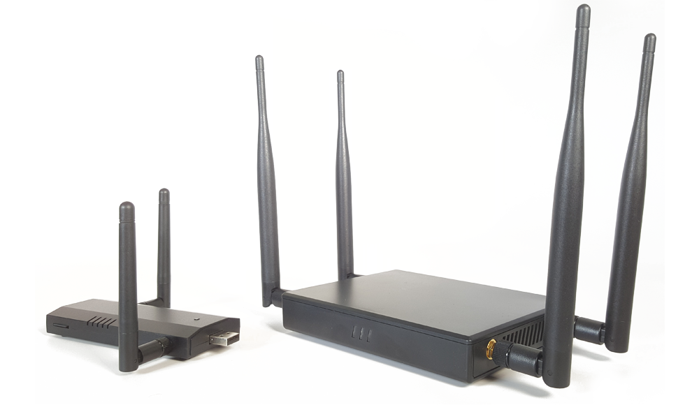

# Network Management, Antivirus, Firewall, Wifi, Monitoring and Logs

### Introduction
This module is designed to be an introduction to some of the major tools and features that are available for a champion to begin implementing basic control of networks and security software within their organisations. It is a huge and complex topic, that would probably take weeks to address effectively. The idea is to highlight major tools and concepts, so that they can consider further exploration of them at some point in future. Also, the aim is to equip them with the basic knowledge that will allow champions to be able to understand and ask questions to effectively manage others will more expert skills in this area - outside consultants etc.

### Learning Goals  
* Understand a basic network architecture
* Know how to locate and store logs
* Test conducting basic analysis of logs
* Identify and understand the positive/negative benefits of various intrusion detection systems, firewalls and antivirus software

### Assessment Goals    
* Have a map of their network architecture
* Be able to find and store logs of devices used within their own organisations

### Recommend Preparations  
N/A

### Suggested Time 
75 minutes with 10 minute break 

### Notes   
N/A

## Activity 
Ask participants to split into groups and draw network maps of all the tools, software and devices that they operate in their organisation.

Trainer Note: Not all participants will have an organisation with a traditional network infrastructure, in fact probably most won't. However, it is important to ensure that participants understand which services they are currently using and how they can monitor/log/manage each of them. There are a number of different ways for a network map to be drawn, but where a more traditional infrastructure exists, it will be important to point out items such as firewalls, DMZ, wifi, services, printers, backup drives etc., likely to be running.

In their groups, ask participants to find and check the logs on their devices. Even without specialist knowledge, what can we understand from them?



* Windows 10 - https://docs.microsoft.com/en-us/windows/device-security/auditing/view-the-security-event-log
* MacOS - https://support.omnigroup.com/console-osx/

    
***Scenarios***  
(Trainer Note: this might be best used at the ed of the module):
In groups, ask participants to run through a series of small scenarios and to document their responses. Examples include:

* A colleague reports that they have accidentally clicked on what they think may have been a spear-phishing email.
* Another organisation in the community sends you an encrypted mail informing you that they have been the victim of hacks that they have traced to an IP address they have confirmed that has been used by adversarial hackers. How can you use this IP address toe ensure you will not be targeted by the same group?
* Sensitive internal organisational data has been leaked by malicious hackers online. You suspect that it must be due to a hack - what actions might you take?       
    
    
## Discussion  
* What type of network is used by each organisation that the participants are from?
* What type of antivirus, firewall and/or intrusion detection do we use on our devices?
* What are the advantages and disadvantages of a self-hosted network?
* What are the benefits and advantages of a "cloud" network?
* Who is responsible for managing the network? 
* If the participant or another individual is responsible, how do comfortable do they feel to manage, secure and verify the integrity of the network?
* If an outside individual or contractor is responsible, do they trust them? What measures can they take to ensure their network is being managed properly?
* What experiences have participants had using specific tools and/or techniques to manage a network? Monitor antivirus reports? Monitor a network? Store and view logs?  
 
## Inputs   

***Networking Mapping with Nmap/Zenmap GUI/Maltego***

The trainer should introduce visual tools such as Zenmap and Maltego to demonstrate the process of mapping a network. Emphasis that this is likely to be one of the first actions to be taken by an attacker. It is important to know what assets are connected to the network and what an attacker will see.

Trainer Note:  NMap and other tools can be fairly complex to master and training in the full, safe, usage of them is probably left to other courses (for example, SAFETAG has excellent resources on it's use), the primary aim is just to give a quick visual demonstration. Also, in order to avoid the problems of scanning a training location network etc. - it is recommended to record a network scan on a network you are allowed to scan and then run it during the training session.


***Event Viewing***    

Highlight the management features of tools such as :    

* Windows Event Viewer:
https://technet.microsoft.com/en-us/library/cc749408.aspx
* MacOS - http://www.macworld.com/article/3102847/macs/hands-on-with-macos-sierras-console-now-its-easier-to-get-the-mac-information-you-need.html
* Linux -  https://www.lifewire.com/introduction-to-linux-log-files-2192233
* Chromebook - https://support.google.com/chrome/a/answer/3293821?hl=en
* G-Suite https://gsuite.google.com/products/admin/

Highlight the utility of tools for easy self hosting such as:

* A demonstration of Sandstorm and/or Cloudron (available on their websites)
* A demonstration of OwnCloud / NextCloud  

  

## Deepening    
***Antivirus, Firewalls and Intrusion Detection Systems***

Definitions

* Antivirus: a type of software designed to prevent, detect and fix malware infections. Example: Windows Defender
* Firewall: software or physical device that monitors traffic to/from your computer and blocks based on a set of rules. Example: Little Snitch for macOS.
* Intrusion Detection System: software or a physical device that monitors systems or a network for malicious activity or policy violations. There are two main types Signature detection (looking for known malicious traffic) and Anomaly Detection (taking a baseline of activity and then looking for unusual activity that occurs after that). Example: Snort (Cross Platform)

Some points to emphasis:

* Ensure users are aware that Macs and phones can also suffer from malware, so ensure protection is available.
* While many professionals believe that antivirus software is no longer useful, that is because many have a strong information security knowledge and do not represent the practices of an average user.

Break participants into groups, ask them to take one or two types of tool and experiment with them. Most participants will already be familiar with basic antivirus tools, such as those on a single device. The objective of this exercise is to get them to:

* Test how to deploy and manage antivirus, firewalls and IDS are managed centrally. This provides a better overview of an organisation.
* Where it is not possible for an organisation or individual to manage centrally, be able to deploy tools quicker than with just regular manual inputs.

Trainer Note: Many of the open source tools available are unfortunately likely to be difficult for participants without a very high technical background to deploy and manage. As such, we recommend highlighting the available tools tools that are available with signficant non-profit discounts from organisations like Techsoup.


Users should research commonly found tools to see what is available. Though we recommend starting with (because trial versions are for download and full versions are on TechSoup):

* Norton for Small Business
* Bit Defender Gravity Zone
* Comodo Endpoint Security Manager



Open source Firewalls:

* PfSense - https://www.pfsense.org
* Untangle Firewall - https://www.untangle.com
* ClearOS - https://www.clearos.com/


Opensource Intrusion Detection Systems:

* Snort
* Suricata
* Bro
* OSSEC 

Trainer Note: Open source IDS systems usually require a significant amount of time to setup initially and/or being comfortable with using command line/Linux. 

***WiFi***  
One method for penetration an organisation is through attacks on WiFI. These mainly take two forms, attacks on weak WiFi security and the use of rogue access points. 

Some methods to reduce WiFi risk include:

* Attacks on weak wifi security usually involve routers usinig a weak protocol such as WEP. It is best to set your routers to WPA2 if possible.  
* Change the WiFi name (SSID) to something that is not easily recognisable as connecting to your organisation.
* If possiible, have a second wifi connection for public or visitors with a different SSID and password.
* WiFI passwords should be strong and of an appropriate length (e.g more than 12 characters with a mix of numbers, letters, uppercase/lower case etc)
* Ensure the SSID and passwords are changed on a regular basis
* Monitor the number of devices on your WiFi
* Use a MAC address filter which devices can connect (though this can be spoofed)
* Using a wired ethernet connection
* Utilise a VPN

    
*Example of a WiFI Pineapple - a popular rogue access point*

Another potential risk is from rogue access points. These are routers, phones or laptops that have been placed near to your home and residence in order to try to gain access to your network or man-in-the-middle your communication. The utilise a number of methods to try to do this, such as creating a fake WiFi network with the same or similar name to your real network. 

Some of the easiest ways to reduce the risks from rougue access points are:

* Check for any SSIDs that are similar to ones used in your office.
* Ensure your router strength only broadcasts over the areas that you need it (for example, the office) and not further than necessary (e.g other parts of the building where someone could try to connect easily without being discovered). Test this by mapping out the location of WiFi devices in your building using a tool such as [Netspot](https://www.netspotapp.com), [NetStumbler](http://www.stumbler.net) or [Airmon-ng](https://www.aircrack-ng.org/)
* Monitor your physical space for equipment that should not be present (for example, rogue access points hidden in a roof or cupboard).
* If using network authentication, use certicates to limit the ability of any rouge access point.
* Use tools such as [Nessus](https://www.tenable.com) to scan the network to look for known rogue access point tools.

## Synthesis 
Participants should turn to their assessment documentation and consider how their organisation deals with the subject matter covered in this module. Where necessary they should ask questions and work with other participants to identify any:
 
* Issues they have found that effect their organisations
* Possible solutions they have learned
* Possible difficulties they may face in implementation (ideally using the time ad experience of trainers and other participants)
* Things would need to overcome these difficulties
* Connections to other organisations or individuals that would help them
* Timeline, resources and costs for implementation

This should be noted in their assessment, for future use.

## Resources    
* [SAFETAG, "Network Scanning," Page 60](https://www.safetag.org)
* [Guide for System Administrators in At‐Risk Organizations: "Network Security"](https://github.com/OpenInternet/System_Administrator_Guide_Text/blob/master/en/best_practices/network_security/index.md)
* [NIST: "Guide to General Server Security"](http://csrc.nist.gov/publications/nistpubs/800-123/SP800-123.pdf)
* [NIST: "An Introduction to Computer Security"](http://csrc.nist.gov/publications/nistpubs/800-12/handbook.pdf)
* [NIST: "Guide to Intrusion Detection and Prevention Systems (IDPS)""](http://csrc.nist.gov/publications/nistpubs/800-94/SP800-94.pdf)
* [SANS "Critical Security Controls"](https://www.sans.org/critical-security-controls/controls)
* [SANS "Detecting and Preventing Rogue Devices on the
Network"](https://www.sans.org/reading-room/whitepapers/detection/detecting-preventing-rogue-devices-network-1866) 
* [Information Ecology: Public Wireless](https://0xacab.org/iecology/security-checklists/blob/master/6_public_wireless_checklist.md)

        