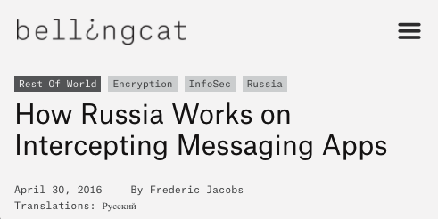
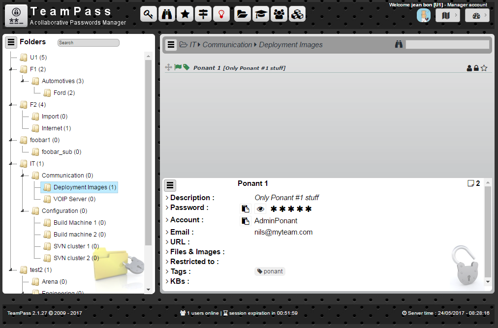
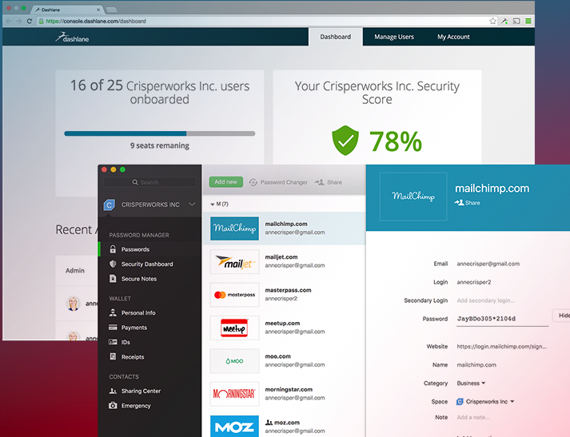
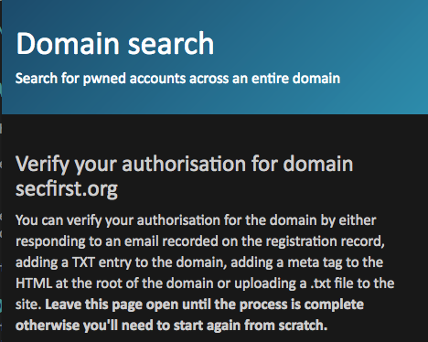
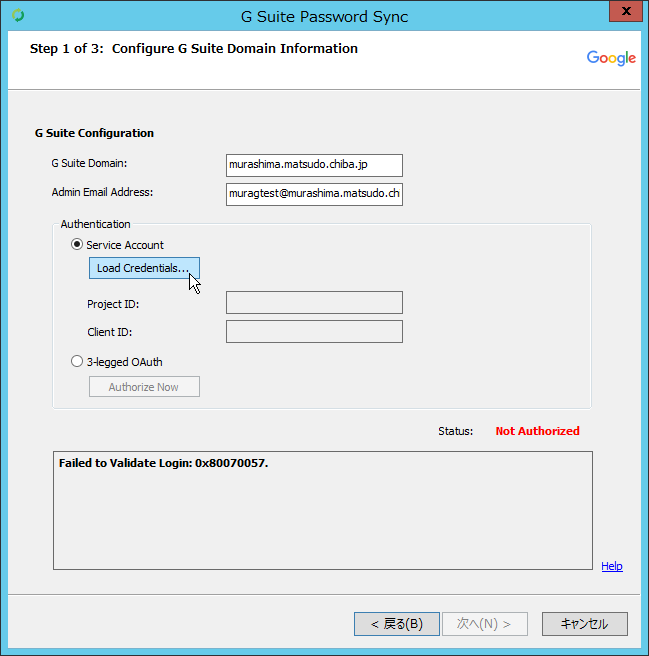
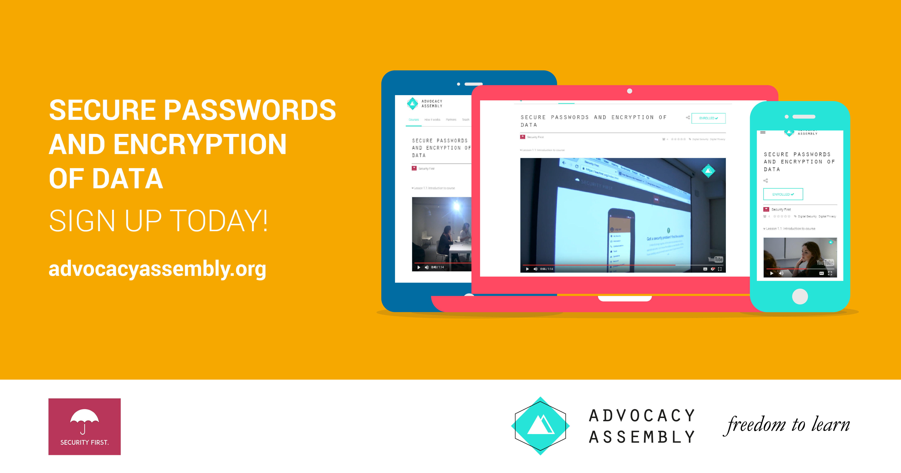

# Password Management

### Introduction
Despite their many problems, passwords continue to be the most common security feature of everything from phones to encrypted cloud storage. As computing power increases and attacks become more widespread, it becomes harder and harder for individuals to create use and store passwords in secure, efficient way. Organisations must also deal with the need to share passwords internally. Password managers offer some help but there are many available and each has different strengths and weaknesses. Other tools like two-factor and tokens are also increasingly common. This module looks at some methods of managing passwords within organisations.

### Learning Goals
* Map the usage of passwords throughout an organisation
* Understand the tools available for password management throughout an organisation
* Understand the settings of various tools (e.g. network management) that enforce password policy
* Discuss and test external keys such as YubiKey

### Assessment Goals
* Add the organisation's recommended tool for password management - including resources useful for teaching. Even if the tool is individual (e.g. KeepassXC) vs. centrally managed
* Identify any services that allow for two factor authentication that are not already enabled

### Recommend Preparations
N/A

### Suggested Time

60 Minutes

### Notes
N/A

## Activity 
* Ask participants to list the variety of passwords and services used by them and their organisations in their work.
* For each of the services, mark if they have two-factor authentication enabled. 
* For each service, also mark if SMS or app generated code is available.
* Ask participants to test estimate the size of the average password that they or the people in their organisations use and test it (e.g. on https://password.kaspersky.com)
* Ask participants to test their email accounts and see if they have been affected any of the main breaches (e.g. https://haveibeenpwned.com/)   

## Discussion  
* What tools do the participants use for password management?
* What are the advantages and disadvantages of each tool?
* What recent cases studies of password managers being breached do we know about? How did they occur?
* Which of these tools can be deployed and managed across organisations?
* How do these tools integrate into a mobile environment?
* What experiences do participants have in managing passwords across organisations? What are the advantages/disadvantages?

## Inputs  
***SMS Two Factor***    

In a number of examples, SMS's used by the services as a second factor of authentication have been intercepted, thus where possible, it should not be used - an app or key should be used instead. (e.g. https://www.bellingcat.com/news/2016/04/30/Russia-telegram-hack/)

***Shared Password Management for Organisations***
A number of services offer shared password management for organisations. Break participants into groups and ask them to test some of them and report back on their advantages and disadvantages. If they already use or have tested a specific service, they should be in a group where they are testing tools they have not used before.

Some possible tools:

* KeepassXC (on a shared drive) - https://keepassxc.org
* Passbolt: https://www.passbolt.com
* Teampass: http://teampass.net
* Lastpass (it has a non-profit discount): https://lastpass.com
* Dashlane: https://www.dashlane.com

***Monitor Domain Breaches***   

     
*Haveibeenpwned.com has a useful and simple feature for managing breaches across a whole domain*

## Deepening 
***Best practices for managing passwords in organisations***    
Current best practices for managing passwords within an organisation that it is recommended a champion understand include:

* Change all default passwords
* Implement two-factor were possible
* Help users cope with password overload
* Understand the limitations of user-generated
passwords
* Understand the advantages and limitations of machine-generated
passwords (e.g those that create phrases for users to remember)
* Prioritise the security of administrator and remote user
accounts
* Use account lockout, passwords blacklists, IP blocking (for remote accounts) and protective monitoring
* Don’t store passwords as plain text

For many years, best practice advice recommended that users were told or forced to change their passwords frequently - typically every 30/60/90 days. However, recently many have questioned this advice - as often it just leads to user frustration, difficulty to remember passwords, password reuse or creation weaknesses (e.g changing from an old password "redpanda1" to "redpanda2"). Instead a focus is now recommended on monitoring logins for unsuccessful attempts and allowing users to use tools such as password managers and hardware tokens.

***Utilise existing administration tools***     
Many organisations with central password control use Microsoft or Google's G-Suite to manage their infrastructure.

* Microsoft Office 365:  https://support.office.com/en-us/article/Office-365-for-business-%E2%80%93-Admin-help-17d3ff3f-3601-466e-b5a1-482b31cfb791
* G-Suite: https://support.google.com/a/answer/3035631?hl=en&ref_topic=3113051 

Use of hardware key/token.
A useful alternative method of securing access is the usage of a hardware token such as a YubiKey. If possible, we recommend that a trainer introduces a hardware token to participants and demonstrates setting it up with a service such as Gmail (https://support.google.com/accounts/answer/6103534?hl=en) or Facebook.

* Where possible it is best to recommend keys that are part of the FIDO ("Fast IDentity Online") Alliance - as these are the most commonly accepted and integrate best with online services.

Examples of popular keys include:

* YubiKey - https://www.yubico.com
* Trezor - https://trezor.io
* Nitrokey - https://www.nitrokey.com
* RSA SecureID - https://www.rsa.com

A  number of keys also have specific storage features such as storing SSH keys, certificates, etc.

It should be noted that hardware tokens come with a number of problems. Such as cost, setup difficulty, and procedures for if they are lost and/or damaged. Ask participants how they feel they may be able to deal with these problems.

***Interactive Online Training***   

For champions working with individuals remotely or who do not have the time to be able to train others in person. A free online short (20 minute) course with video and quizzes on passwords designed by [Security First](https://wwww.secfirst.org) is available in English, Arabic, and Farsi for free on [Advocacy Assembly](https://advocacyassembly.org).

## Synthesis   
Participants should turn to their assessment documentation and consider how their organisation deals with the subject matter covered in this module. Where necessary they should ask questions and work with other participants to identify any:
 
* Issues they have found that affect their organisations
* Possible solutions they have learned
* Possible difficulties they may face in implementation (ideally using the time and experience of trainers and other participants)
* Things would need to overcome these difficulties
* Connections to other organisations or individuals that would help them
* Timeline, resources and costs for implementation

This should be noted in their assessment, for future use. 

In line with keeping this curriculum as an updated community tool, we would also ask that participants provide comments, feedback and new ideas for this module on the project website and/or Github!

## Resources

* [Security In a Box - Create and Maintain Secure Passwords](https://securityinabox.org/en/guide/passwords/)
* [EFF Suveillance Self Defence - Creating Strong Passwords](https://ssd.eff.org/en/module/creating-strong-passwords)
* [Umbrella App - Passwords](https://www.secfirst.org)
* [Centre for the Protection of National Infrastructure](https://www.cyberstrategies.co.uk/admin/resources/passwordguidance-simplifyingyourapproach.pdf)
* [Information Ecology - Authentication Checklist](https://0xacab.org/iecology/security-checklists/blob/master/5_authentication_checklist.md)
