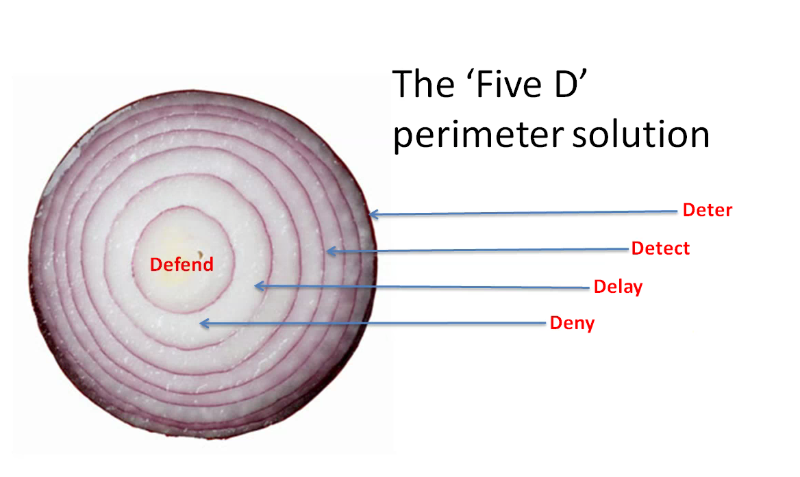
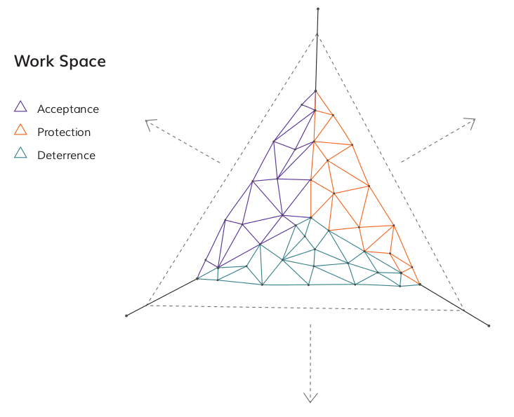

# Physical Security

### Introduction
The physical security of devices is a common issue faced by people in the Champion role. Also, it is very easy to focus purely on digital tools and forgot physical information, such as paper documents and files etc. Civil society groups are also increasingly at risk because of the use of harassment activities such as office raids, arrests and device seizure at borders etc. Many secure mitigations can be negated if physical access to the device is gained. This module aims to look at security measures that an organisation can to manage and mitigate physical security threats.

### Learning Goals

* Understand the layering system of physical security
* Map the physical location of the training as an example of physical security assessment
* Identify various physical security controls and their strengths/weaknesses

### Assessment Goals
Select physical controls that might be relevant to their own home/office environments

### Recommend Preparations
If conducting the red team exercise, ensure to plan for any security issues that may occur by accident. Inform other people in the training location etc.

### Suggested Time

45 Minutes

### Notes
N/A

## Activity    
**Red Team Exercise**       
Participants will be broken into pairs and asked to do a draw and write a basic physical site security assessment. (Trainer note: this can often look very suspicious, so it is best to notify people at the training location that this will be occurring. Also to tell participants to be discrete and what to say if they are asked what they are doing. Whether this exercise goes ahead depends on your initial training setup risk assessment). 

Participants should start from outside the training location and move inwards all the way to the exact room where the training is being conducted. They should be asked to think like a "red team" or someone trying to gain access to devices physically located in the training room. They should draw and/or write security weaknesses and strengths that they see along the way and provide mitigations where necessary. For example, they may notice that there is a receptionist at a front door but that someone can easily gain access to a car park. They may see that CCTV blocks the way but the cameras are not watched and it's possible to gain access to the training room without being stopped, as it is difficult for people to know who is a stranger. Once in the room, they may notice that there is no place to lock away laptops and that some of them are unattended and without a password.

## Discussion  
* What physical security incidents have participants experienced or heard about?
* How might these be mitigated?
* What did we learn from the red team exercise?
* What positive security features are there?
* What negative security features are there?
* How might we mitigate the negative security features?
* What would be the hazards if people could gain access to the participant's homes and offices?

## Inputs  

It is useful to consider physical security as we might consider digital security -  the layers of an onion. Layered defences act as a deterrent. The more layers that an adversary has to peal the more space and time they have to be exposed and that we have to potentially apprehend them. 

It can be useful to consider physical security risks by referring the information gathering cycle that an adversary may de facto use (whether they a petty thief or a sophisticated government). In this, the adversary is most exposed (and thus most likely to be caught) when they are conducting surveillance of a physical location. This is the time when they must position themselves in such a way that they can observe your location. For example, a thief wishing to steal IT equipment may position themselves so they can observer when people leave your location in the evening so that they know when it is a good time to break into the building.

When building our layers of the physical security onion, we often tend to think purely of physical objects such as walls, locks, cameras and doors. It is important to also consider other factors that act as layers and provide early warning of problems, for example, friendly people in the local community, neighbouring organisations, sympathisers amongst potential adversary etc.

## Deepening   
***Security Strategies***   
Security strategies used by civil society groups generally use one or more of the following methods:

Source: [The Holistic Security Manual](https://holistic-security.tacticaltech.org)

* Acceptance - being welcomed within a community and without adversaries who may seek to do you or your organisation harm
* Protection - using methods to defend yourself from harm
* Detterance - creating fears within adversaries that they may be retaliated against if you are harmed

***Identifying Physical Surveillance***  
There is a lot about the process of physical surveillance and identifying it in [Umbrella App](https://www.secfirst.org).

## Synthesis   
Participants should turn to their assessment documentation and consider how their organisation deals with the subject matter covered in this module. Where necessary they should ask questions and work with other participants to identify any:
 
* Issues they have found that affect their organisations
* Possible solutions they have learned
* Possible difficulties they may face in implementation (ideally using the time and experience of trainers and other participants)
* Things would need to overcome these difficulties
* Connections to other organisations or individuals that would help them
* Timeline, resources and costs for implementation

This should be noted in their assessment, for future use. 

In line with keeping this curriculum as an updated community tool, we would also ask that participants provide comments, feedback and new ideas for this module on the project website and/or Github!

## Resources
* [Guide for System Administrators in At‐Risk Organizations: Physical Security](https://github.com/OpenInternet/System_Administrator_Guide_Text/blob/master/en/best_practices/physical_security/index.md)