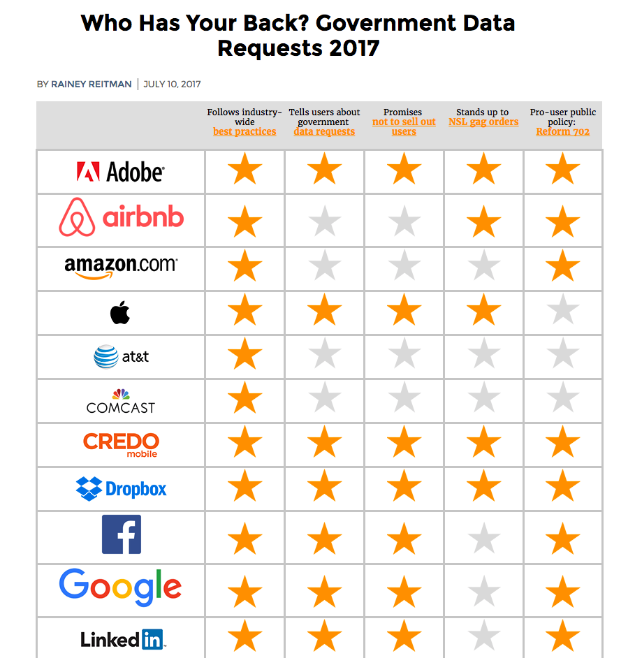
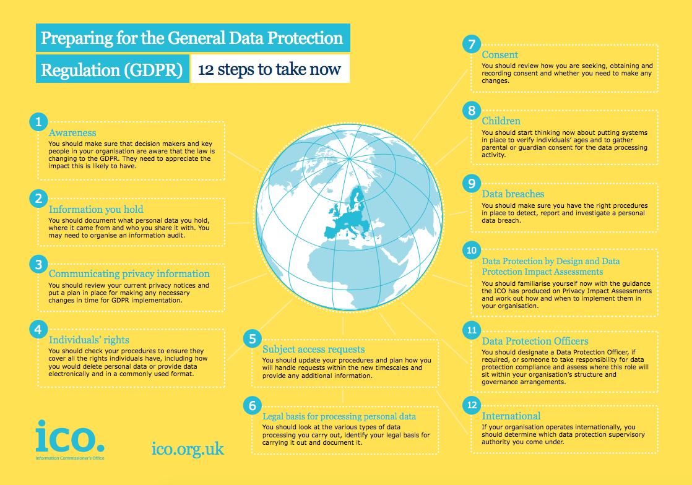
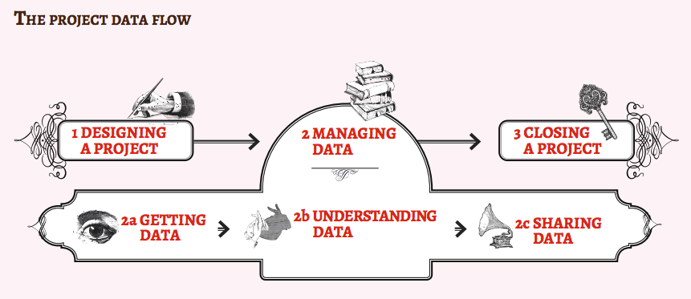

# Privacy, Data Protection and Responsible Data

### Introduction
The objective of this module is to introduce champions to the key concepts they need to be familiar with in other to safely manage privacy issues and ensure the sensitive data they hold on individuals meet basic legal requirements and ethical requirements.

### Learning Goals
* Understand privacy and data protection policies - including country, industry and best practice    
* Look at how third part and/or cloud provider policies can affect their security

### Assessment Goals
* Know which policies affect the work of the organisation
* Highlight areas the organisation must address to be able to meet privacy and data protection standards

### Recommend Preparations
Print off privacy and/or relevant data protection policies for a variety of organistions, so that participants can investigate them during the training. Where possible this should also include the any that are used by the organisations that the participants represent so that any missing features can be easily identified.

### Suggested Time
45 Minutes

### Notes
Data protection regulation varies greatly from country to country. Where possible, you should customise this module based on the laws that champions operate in. We have chosen to base the legal aspects of this module primarily on EU law, as it is one of the strongest global frameworks and it's likely to be mirrored in many jurisdictions. 

## Activity
Break the participants into groups and ask them to examine and critically analyse the privacy and data protection policies from a variety of groups, for example, Google, Facebook, the UN, their own organisations etc. Ask them to feedback on: 

* How easy it is or isn't to read the policies
* What each policy allows the organisation to do or not to do with it
* What they think needs to be added to make them feel more comfortable using the service or organisation
    
## Discussion 
* What does privacy mean to the participants?
* What data do they collect in their organisations?
* What expectations do they have of people who manage their data? (Give examples such as their doctor, their bank, the government Google, Facebook etc.)
* Do they or their organisations meet these expectations for others?
* What relevant laws on data protection and privacy do they have in their country?
* Do they know of any examples of their organisation or similar organisations breaching data protection?
* What are the privacy and data protection policies of the providers they work with? 

## Inputs 
***Who's has your back?***  
The Electronic Frontier Foundation has developed a simple scorecard of how many (primarily US-based) companies are deals with the legal aspects of user privacy.

Source: [EFF "Who has your back?"](https://www.eff.org/who-has-your-back-2017)

***General Data Protection Regulation***  
There are many different privacy and data protection rules that apply to the data that you store and hold.

Because it is one of the most impacting and comprehensive, we are going to use the framework on the European Union General Data Protection Regulation.

It create's two distinct roles and sets of responsibilities.

Data Controller is the is the individual or entity who controls and is responsible for the for the collection and keeping of personal data. (For example, your organisation is they collect information on donors or individuals at risk.)

Data Processor is the individual or entity who holds or processes the data but does not exercise responsibility or control over the personal data.

Many nonprofits are likely to be affected by it. Large fines for data protection failures have already been given out in the past and these are due to get bigger.

It has strong features such as:

* It's scope is very wide and includes all EU citizen data and data held by companies in the EU and/or with special arrangement outside of it
* Individuals or "data subjects" have a lot of rights including the right to be forgotten, portability, correction and to not be subject to adverse decisions caused by automated processing.
* Data protection fines can now be up to €20 million Euro or 4% of turnover, whichever is higher  
* Organisations must be clearer about why, how, where they store data and for how long
* Organisations must clearly explain their data protection policies when seeking consent. It cannot be hidden in legal jargon as part of terms and conditions.
* If collecting "sensitive" data that can identify or adversely affect an individual, they must take makes to ensure its protection.
* Examples of protection include encryption or making the data pseudonymous or anonymous
* Data cannot be used for purposes other than the reasons that an individual agreed it to be collected for. With the exception of statistics, legal or public health purposes.

Source: [UK Information Commissioner Office](https://ico.org.uk/)

***Responsible Data***  
A number of civil society groups have been jointly working to share lessons and best practices for gathering and using data. This is known as the "Responsible Data" Project.

The group has defined that the responsible use of data is *"The duty to ensure people’s rights to consent, privacy security and ownership around the information processes of collection, analysis, storage, presentation and reuse of data while respecting the values of transparency and openness.”*

The project has created a handbook designed specifically for helping civil society groups develop, manage and close projects that hold sensitive information. It covers everything from survey choice to selecting hosting providers.

Source: [The Responsible Data Handbook](https://responsibledata.io)

## Deepening 
Based on the outline of the GDPR, or other relevant legislation, along with the principals of Responsible Data. Split the participants into groups and give them a task to design a project taking into consideration all of these aspects. Example projects might include topics such as:

* The setup of a new fundraising database which holds lots of information about potential new donors
* A hosted database that aims to record testimony and incident reports from victims of topic likely to contain sensitive data about a topic such as domestic and sexual assault
* A new system in your organisation for managing recruitment, payroll, disciplinary action, social security information - all of which is stored with a third party in their cloud
  
## Synthesis   
Participants should turn to their assessment documentation and consider how their organisation deals with the subject matter covered in this module. Where necessary they should ask questions and work with other participants to identify any:
 
* Issues they have found that affect their organisations
* Possible solutions they have learned
* Possible difficulties they may face in implementation (ideally using the time and experience of trainers and other participants)
* Things would need to overcome these difficulties
* Connections to other organisations or individuals that would help them
* Timeline, resources and costs for implementation

This should be noted in their assessment, for future use. 

In line with keeping this curriculum as an updated community tool, we would also ask that participants provide comments, feedback and new ideas for this module on the project website and/or Github!

## Resources

* [Responsible Data Handbook](https://responsibledata.io/resources/handbook/)
* [Facebook Privacy Policy](https://www.facebook.com/policy.php)
* [Google Privacy Policy](https://www.google.com/policies/privacy/)
* [Twitter Privacy Policy](https://twitter.com/privacy)
* [United Nations Privacy Policy](http://www.un.org/en/sections/about-website/privacy-notice/)
* [The Guardian Privacy Policy](https://www.theguardian.com/info/privacy)
* [Open Whisper Systems Privacy Policy](https://whispersystems.org/signal/privacy/)
* [Tor Project Privacy Policy](https://donate.torproject.org/privacy-policy.html)
* [Comparing the privacy policy of internet giants side-by-side](https://www.comparitech.com/blog/vpn-privacy/we-compared-the-privacy-policies-of-internet-giants-side-by-side/)
* [DLA Piper - Data Protection Laws of the World](https://www.dlapiperdataprotection.com) 
* [European Union - General Data Protection Regulation](http://www.eugdpr.org)    
* [Privacy Policy Generators](https://digital.com/blog/best-privacy-policy-generators/)   
* [Guide for System Administrators in At‐Risk Organizations: Ensuring User Data Protection and Privacy](https://github.com/mahvashtaqi/System_Administrator_Guide_Text/blob/master/en/best_practices/ensuring_user_data_protection_and_privacy/index.md)