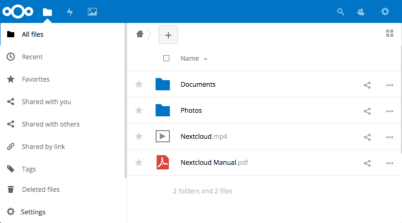
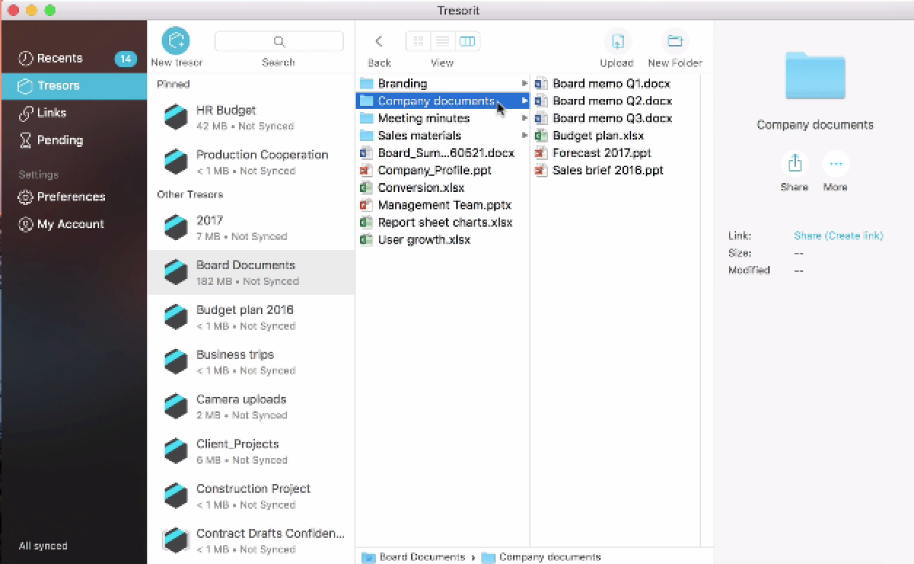

# Resilience, Continuity, and Backups

### Introduction
In earlier modules, we identified that if we want to lower risk, we can either reduce the likelihood that something will occur or reduce its effect if it does occur. There is often a tendency to focus on the preparation and not the aftermath. This chapter attempts to deal with this by considering some tools we can use for creating resiliency within organisations.

### Learning Goals
* Understand the strength and weaknesses of self-hosted vs. cloud hosted
* Understand the various tools available for secure end-to-end hosting and backups 
* Understand basic business continuity concepts

### Assessment Goals
* Add a specific backup solution to the assessment (if not already using one)
* Add a basic business continuity plan if relevant

### Recommend Preparations
Print off example business continuity plans in advance.

Participants are likely to be already familiar with a number of the tools, yet they may not have had an opportunity to use the management features of many of them. To make training environment setup easier

### Suggested Time

30 Minutes

### Notes
N/A

## Activity    
N/A

## Discussion  
With post-it notes or flipchart, ask participants to list:

* What do they consider the term "resilience" within their own organisations?
* What type of resilience incidents might occur? (e.g fire, office raid, rioting, drive failure etc.)
* What backup services do they currently use?
* What size backup storage they need as individuals and as organisations?
* What and where is the data that needs to be backed up? 
* Where are the backup locations? (e.g onsite, offsite)
* Have backup services been fully tested? (they often fail)
* What steps would be needed to ensure operations and communications continue?
* Is it an option for staff to work remotely (such as at home)?
* Is there an inventory of assets such as laptops, drives, phones etc? Are they covered by insurance? Are appropriate proof of purchase receipts and warranties kept?

The advantages and disadvantages of these methods/services for issues such as:

* Security
* Size/cost
* Usability
* Management Control

## Inputs  
Business continuity is defined as the capability of the organization to continue delivery of services and or operations at acceptable predefined levels following a disruptive incident. There are many methodologies for managing business continuity.

What sort of incidents do participants believe they would consider disruptive?

*Next Cloud is an open source, self-hosted backup tool*

There are a number of methods for small organisations implementing simple methods for backups and resiliency. These include:

* Self-hosting on their own internal network - e.g. Microsoft File Sharing, NextCloud
* Self-managing in the cloud - for example using Amazon Web Services, Digital Ocean or Eclips.is to run a server with backup applications that you control - e.g. NextCloud, Syncthing, Sparkleshare
* Propriety cloud backups - e.g. Dropbox, One Drive or Google Drive
* Propriety cloud backups with an extra layer of encryption - e.g. Dropbox or Google Drive with Cryptomator
* Proprietary cloud backups with end to end encryption - e.g. Tresorit (offers 10 free users for Non-profits) or Spideroak

*Tresorit is closed source, end-to-end encrypted tool*

***Business Continuity***
An important aspect of ensuring an organisation is resilient, is the process of Business Continuity Planning (BCP). Many smaller civil society organisations feel that this is not relevant to them, however, plans do not have to be complex. Also, many organisations face a variety of threats unique to them - from office raids to hacktivists.

When working out the time periods It is recommended to divided the  is divided into segments of time such as the following:

**Reduce** - the period of time before the disaster.

**Response** - the hours and days immediately following the disaster.

**Recover**- the period from the occurrence of the disaster until temporary operations or alternative processing are executed.

**Resume** - the time whereby business functions and operations are resumed at an alternate site.

**Restore** - the restoration of non-critical functions and damaged infrastructures.

**Return** - the time when operations return to normal.

Source: [Goh, Moh Heng (2008). BCMPedia. A Wiki Glossary for Business Continuity Management, BCM Institute.](http://www.bcmpedia.org/wiki/Main_Page)

## Deepening 
  
Break the participants into groups of about four. Each group should choose one or more of the tools mentioned (or others that they know of) and test them by trying to setup them up and share files with each other. The primary aim is not just to have an individual backup, but to test features or develop methodologies that allow would allow them to deploy and manage tools in a small organisation. They should report back on issues such as:

* Difficulty to setup
* Security
* Ease of use
* Speed
* Usability
* Features
* Management Features

Break participants into groups and ask them to review a basic Business Continuity Plan. Ask them to report back on:

* What parts of the plan do they think would be relevant to them?
* Based on the list of incidents they previously considered disruptive. Add them into the plan and create checklists of actions they think they would need to take in order to mitigate the effects. For example, a fire in the office or authorities seizing critical computers.

## Synthesis   
Participants should turn to their assessment documentation and consider how their organisation deals with the subject matter covered in this module. Where necessary they should ask questions and work with other participants to identify any:
 
* Issues they have found that affect their organisations
* Possible solutions they have learned
* Possible difficulties they may face in implementation (ideally using the time and experience of trainers and other participants)
* Things would need to overcome these difficulties
* Connections to other organisations or individuals that would help them
* Timeline, resources and costs for implementation

This should be noted in their assessment, for future use. 

In line with keeping this curriculum as an updated community tool, we would also ask that participants provide comments, feedback and new ideas for this module on the project website and/or Github!

## Resources
* [TechSoup: The Resilient Organization - a guide to IT disaster recovery](http://www.techsoup.org/SiteCollectionDocuments/resilient-organization-pdf-full-document.pdf)
* [Guide for System Administrators in At‐Risk Organizations: Data Security, Backup, and Recovery](https://github.com/OpenInternet/System_Administrator_Guide_Text/blob/master/en/best_practices/data_security_backup_and_recovery/index.md)