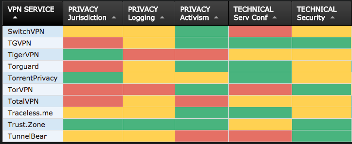
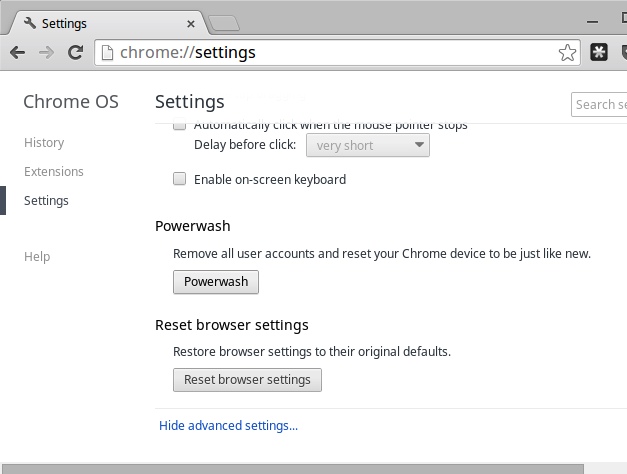

# Travel

### Introduction
Travel is often the time when individuals are most at risk. Civil society members are often exposed to both regular risks in a place and increased risks specifically because of who they are and what they do. They are often in locations they are unfamiliar with and may rely on others for parts or all of their security. Also, individuals may have to travel through places such as airports or hotels, where devices may be seized or networks monitored. Moreover, it is often difficult for a Champion to know exactly what the information risk may be in the new location, so methodology and tool choice can be complex - especially where infrastructure is poor. This module deals with some methods for securing information when travelling.

### Learning Goals

* Understand how to threat model the locations where they or their team may travel to - including law and operational aspects
* Learn how to best prepare equipment and systems for travel (e.g. "clean" laptop)
* Discuss the advantages/disadvantage of Remote Access

### Assessment Goals
* Conduct basic information security travel assessment for the locations where they travel to
* Add information security to any existing travel planning documentation they already have

### Recommend Preparations
N/A

### Suggested Time
45 mins

### Notes

## Activity    
**Travel Briefing Game**

* Participants are split into groups of two people. One person will be a colleague about to travel to a nearby country (given by the trainer). The other person will be designated the as the IT person who needs to brief their colleague on the what information security measures they should take when travelling to the country. 
(Trainer Note: Try to pick real countries that the participants are likely to use. Where possible have a mix of different information security risks - e.g. device seizure, malicious hotel Wi-Fi etc.).

* The participants who are conducting the briefing have ten minutes to come up with a very quick plan and then  will have five minutes to communicate verbally that information to their "colleague"

***The should cover issues such as:***

* What are known risks in the country? What previous have relevant incidents occurred?
* What potential issues may they face when entering, in, leaving the country? (e.g. malicious updates sent to phone, theft of equipment, "evil maid" attacks)
* What are the recommended methods for mitigating the identified risks? (e.g. VPN usage, use of clean laptop)
* What actions need to be taken for implementing the mitigation? (Purchase VPN, need to plan for a number of hours to securely wipe the "clean laptop" etc.)

Trainer Note: If time permits, the individual designated as a colleague can also practice this process. Their role is to act as the IT person and they must create a similar plan and send it to an activist in the field who is leaving a country to come and attend a training. Instead of verbally, this plan should be sent via a secure method such as encrypted email or Signal. The objective of this exercise is to create test two common scenarios that a champion finds themselves having to deal with.

## Discussion 
* What type of threats do participants and their organisations face when travelling?
* What have been their previous experiences?
* How commonly do they happen?
* What tools and techniques have been used for mitigating problems when travelling?
* What resources do participants use for threat modelling when they travel or are asked to advise others in their organisation how to travel safely using devices?
* How can this process be managed and integrated by participants into their own organisations?   
 
## Inputs  
***Travel Tools***  
There are a number of guides for information security when travelling. 

For example:

* [EFF - Travel Screening](https://www.eff.org/issues/travel-screening)
* [Umbrella App - Travel Sections](https://www.secfirst.org)
* [University of Arizona: Guidelines for International Travel](https://security.arizona.edu/security-guidelines-international-travel)

***VPN Choice***    
VPN choice for an organisation is often tricky. Champions often find themselves asked questions about which services are best to use. [That One Privacy Site](https://thatoneprivacysite.net) has been created to make it easier to compare features such as privacy, cost, and logging.

*Example of the comparison on "That One Privacy Site"*

## Deepening   
**"Clean" Laptop**  
A number of organisations issue an older or spare laptop for travelling.

**Delete and Download**     
Another technique is to securely delete information from a device, travel to a destination and then download from there. Often this can cause a number of problems though, especially if the local internet connection is poor and/or people are reluctant to delete files/emails etc. stored locally. Especially this can be a problem for personal mobile phones.

**Chromebook "Powerwash" Feature**  
Many organisations utilise G-Suite and/or Chromebooks as cheap, easy to use travel laptops. One of the useful features of the Chromebooks is called "Powerwash." This allows users to easily wipe local data, travel to a location and then restore user accounts later on.

**Remote Access**   
There are a number of systems available to allow organisations to manage remote access. This can often be a useful method of security when access

TODO: INSERT REMOTE ACCESS OPTIONS

## Synthesis   
Participants should turn to their assessment documentation and consider how their organisation deals with the subject matter covered in this module. Where necessary they should ask questions and work with other participants to identify any:
 
* Issues they have found that affect their organisations
* Possible solutions they have learned
* Possible difficulties they may face in implementation (ideally using the time and experience of trainers and other participants)
* Things would need to overcome these difficulties
* Connections to other organisations or individuals that would help them
* Timeline, resources and costs for implementation

This should be noted in their assessment, for future use. 

In line with keeping this curriculum as an updated community tool, we would also ask that participants provide comments, feedback and new ideas for this module on the project website and/or Github!

## Resources
* [Guide for System Administrators in At‐Risk Organizations: Know your Rights](https://github.com/mahvashtaqi/System_Administrator_Guide_Text/blob/master/en/best_practices/know_your_rights/index.md)