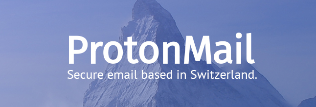
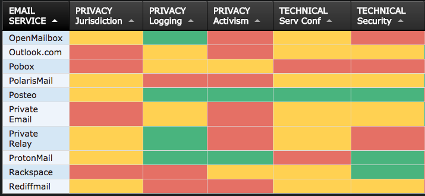
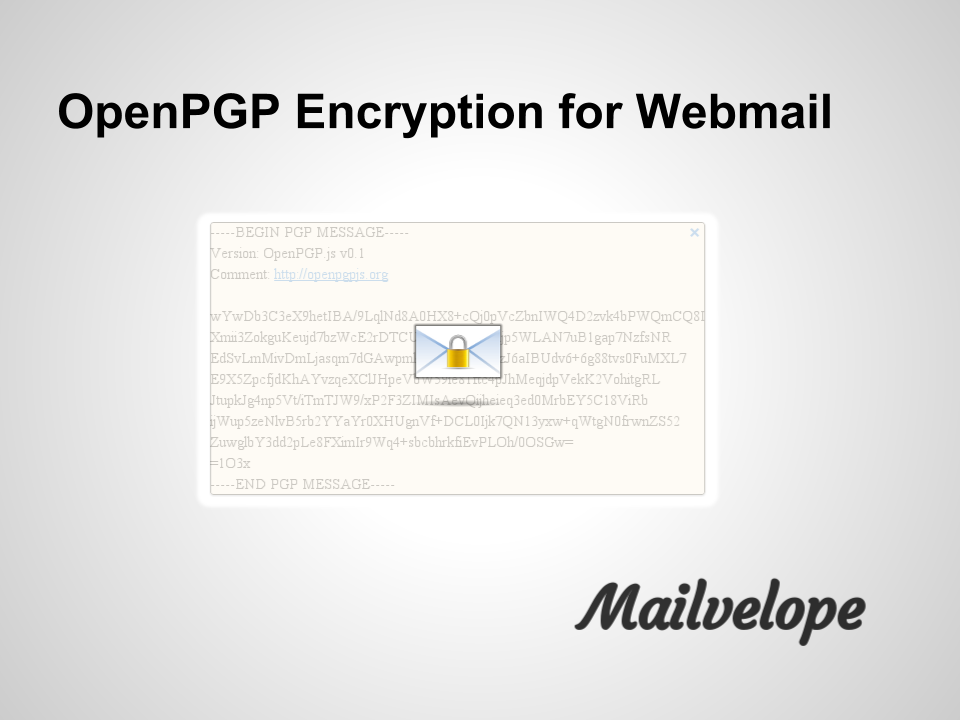

# Web and Email Management

### Introduction
All organisations use email in some form and most have an online presence. This module introduces some of the management features for popular email tools and also recommends a number of methods for mitigating website hosting risks.

### Learning Goals
Learning Goals: 

* Understand the advantages and disadvantages of web providers and hosts (including analysis of specific companies)
* Understand the advantages and disadvantages of self-hosting vs. cloud
* Test and assess the feature sets of G-Apps Suite, Office365, and Exchange and/or other systems for management.
* Test and assess the security features of web hosting platforms such as Wordpress, introduce LetsEncrypt
* Understand services providing free DDoS protection for HRDs
* Assess the security and usage of "privacy friendly services such as Protonmail and Tutanota
* Assess the advantages/disadvantages of PGP tools and implementations and management of keys

   
### Assessment Goals
* Add any necessary changes to security and privacy features of their organisations email service   
* Add any necessary changes to their organisation's web hosting service (e.g. Wordpress)    
* Add DDoS protection service (if needed)   

### Recommend Preparations
Where possible, it would be best for the trainer to have access to trial or demo versions of the tools that are likely to be used in the module. Ideally, participants will be able to then login and test them for themselves - without causing disruption to live systems. For example, G-Apps Suite, Protonmail, Wordpress etc.

### Suggested Time
60 Minutes
    
### Notes
N/A

## Activity    
Ask participants to draw a map of the web and email services they and their organisation use for work. 

Get them to describe details such as costs, advantages, disadvantages, features, privacy, maintenance effort etc.

## Discussion  
* What operations or security issues have participants experienced in their work when using web services or email?
* What are the advantages and disadvantages of cloud vs. self-hosted tools?
* What capabilities do you need to securely manage self-hosted tools?  
  
For those who have implemented PGP within their own organisations. 

* How have did they do it? 
* Is it an individual responsibility? (E.g each user creates and manages their own PGP email, shares keys)
* Is it managed centrally? (e.g using a tool such as Symantec Key Management Server)
* What other methods have individuals found to management PGP deployment?

## Inputs  
A number of privacy-focused email services have emerged that aim to make encryption easier. In particular ProtonMail and Tutanota. Setup an account with both and show the features of each. Ask the participants, what they think the advantages and disadvantages of such services are. For example easy of use versus vendor lock-in.

Show the security features and management of:
Gmail, G-Suite, Microsoft 365 and Microsoft Exchange.

* Show how to set-up a Certbot Certificate
* Show Cloudron and Sandcats, Mailpile
* Emphasis that Docker can also provide some of the functionality but requires more maintenance and setup

Ask participants, would they consider using a tool such as Cloudron? Why?

A hosting provider with free hosting for civil society groups is called Eclips.is https://eclips.is/    

## Deepening
***Securing Regualar Email***     

*G-Mail*    
Many organisations rely on Google for their email. Either by integrating it into the personal email accounts of their staff or by using managing it with Google Suite. Champions are already likely to know about the security features of personal G-Mail but if not it can do things such as:

* Two-Factor Authentication
* List Recently Used Devices
* List Last Account Activity
* Manage apps with access to the Google Account
* Use hardware tokens such as a YubiKey
* For some attacks, it may notify individuals if they have possibly been the victim of "government-backed attackers"

Where organisations are reliant on using personal G-Mail for communications. It is recommended that a champion would help individuals conduct a training and/or a review of all of their email settings, to enhance security.

*G-Suite*
Using Google G-Suite to manage email within an organisation also offers a number of additional security features. For example:

* Easily add and remove users
* Reset passwords
* Use a Single Sign-on (SSO)
* Add or force users to users to use two-step verification
* Manage security settings on user devices
* Lock and remote wipe user devices
* Malicious link and file scanning
* Get alerts about suspicious activity across the organisation
* View audit logs

*Office 365*
Office 365 administration offers a number of security features in its administrator settings, such as:

* Easily add and remove users
* Reset passwords (both individual and in bulk)
* Set password expiration policy
* Create with different permissions (staff, administrators etc)
* Control sharing of documents internally and externally (including options for anonymously)
* Options to extend it with email malicious link and attachment scanning
* Support for two-factor authentication
* Mobile Device Management features
* Integrate with Azure Active Directory
* Can choose which region to store your data
* Templates for Data Loss Prevention (e.g scanning for specific sensitive information and blocking it from leaving the organisation)

***Encrypted Email Services***   
A number of services have become popular that attempt to make it easier for individuals to use encrypted email. Examples of them include [Protonmail](https://www.protonmail.com) and [Tutanota](https://www.tutanota.com). Choice of secure email service can often be tricky. Champions often find themselves asked questions about which services are best to use. [That One Privacy Site](https://thatoneprivacysite.net) has been created to make it easier to compare features such as privacy, cost, and logging.

*Example of the comparison on "That One Privacy Site"*

Some advantages of these:

* Ease of setup and use
* Free tiers for individuals
* Good mobile apps
* Can be white labelled / used with organisation's domain
* Less associated with activism then well-known services such as Hushmail or Riseup
* Ability to send an encrypted email to an individual, not on the service (Tutanota allows a plaintext email to be sent with a link to a password-protected email - the password must be sent through another channel)

Disadvantages

* They are closed, proprietary systems. Only mail between account holders is encrypted. Users must trust the company.
* No integration with PGP 
* Don't integrate with third-party tools such as Outlook, Thunderbird, Mail, K-9 Mail etc
* Not possible to export email to other services  
* No verification of email addresses (easy to send a unencrypted email to a nonservice account

Virtu is another secure mail service that provides integrates into existing Google or Microsoft email products. Its encryption is also proprietary.

***Managing Secure Email***     
PGP - Individual
Most Champions will already have experience using PGP for individuals - e.g Gpg4win with Outlook, Enigmail with Thunderbird, GPG Tools with Apple Mail, OpenKeychain with K-9 Mail, Mailvelope with Chrome/Firefox. There are many excellent resources available for that online.

PGP - Management
There are very few tools available to manage PGP implementations across an organisation. Symantec offers a number of tools such as Desktop Mail Encryption and Gateway Email Encryption. This is probably the most commonly used tool for central management and deployed of PGP within an organisation, however, it has a number of problems:

* It is expensive
* It can be complex to deploy
* It's mobile apps for viewing encrypted emails are of poor quality
* It only integrates with Microsoft Exchange Server or IBM Domino

There are a number of open source tools that attempt to make key exchange within organisations easier, including [Mailvelope Key Server](https://keys.mailvelope.com) and [Hockeypuck](https://hockeypuck.github.io).

***Avoiding Abuse and Spam Lists***   

Civil society groups are often targets for email abuse. Often this can lead to the spread of spam from an organisations domain which can lead to emails being blocked. To prevent this, an organisation should set up a Sender Policy Framework (SPF) and DomainKeys Identified Mail (DKIM). 

* An SPF record allows the receiving server of a mail to check that it originated from the authorised host.
* A DKIM adds a digital signature to outgoing emails to verify that the message comes from your domain and has not be manipulated enroute. 

Most email providers allow you to set up both of these services. For G-Suite you can find out how to setup [SPF](https://support.google.com/a/answer/178723?hl=en) and [DKIM](https://support.google.com/a/answer/174124?hl=en).

If sending email to a lot of people (for example a newsletter), it is better to either send from a different domain/subdomain (e.g securityletter.com instead of security.com). Alternatively, using a services such as [Mailchimp](https://mailchimp.com/) or [GetResponse](https://www.getresponse.com/). 

***Managing Websites***    

*Wordpress*     
Wordpress is a very common platform for organisations to host their websites. In 2016, 60% of websites using a Content Management System used it (Joomla was 7% and Drupal 5%). Because of its popularity, it is regularly targeted for attack. 

Basic methods of increasing the security of Wordpress include:  

* Use a strong password and two-factor authentication to login
* Limit access and minimise permissions for folders, users, and admins 
* Change the default admin name
* Update regularly (weekly or monthly at a minimum)
* Only install and use extra plugins that you really need
* Do not install pirated themes or plugins
* Keep backups
* Hide the login area
* Lock-out or delay users after a number of attempts to avoid bruteforcing
* If using a security plugin such as Wordfence Security, it is best not to run another similar plugin, as they can often cause problems when running together
* Run a reputable anti-malware scanner
* Check logs for intrusion attempts

For more ways to harden Wordpress deployments, see:
[Hardening Wordpress](https://codex.wordpress.org/Hardening_WordPress)

*Website Security*  
All websites and web applications can potentially be at risk from a variety of possible attack methods. While there are many ways to set up and run a website or application securely, there are ten top mitigations that are recommended for best practice.

[OWASP Top 10 Cheat Sheet for Web Security](https://www.owasp.org/index.php/OWASP_Top_Ten_Cheat_Sheet)

*Distributed Denial of Service (DDoS)*  

Many civil society groups are the targets of DDoS attacks both randomly and targeted because of their work. Such attacks can damage services, drive up hosting costs and block the websites from operating. A number of services exist that protect from DDoS and are free to civil society groups. For example:

* Deflect - https://deflect.ca
* Google Project Shield - https://projectshield.withgoogle.com/

*Making your website available over Tor*    
In a number of countries, temporary or full blocking and censorship of websites can often occur. Also, visiting your website might attract suspicion. To make a copy of your own website available as a .onion site over Tor, there is now a tool that makes that a lot easier, called the Enterprise Onion Toolkit
https://github.com/alecmuffett/eotk 
   
## Synthesis   
Participants should turn to their assessment documentation and consider how their organisation deals with the subject matter covered in this module. Where necessary they should ask questions and work with other participants to identify any:
 
* Issues they have found that affect their organisations
* Possible solutions they have learned
* Possible difficulties they may face in implementation (ideally using the time and experience of trainers and other participants)
* Things would need to overcome these difficulties
* Connections to other organisations or individuals that would help them
* Timeline, resources and costs for implementation

This should be noted in their assessment, for future use.

In line with keeping this curriculum as an updated community tool, we would also ask that participants provide comments, feedback and new ideas for this module on the project website and/or Github!

## Resources
* [Information Ecology: Email Safety Checklist](https://0xacab.org/iecology/security-checklists/blob/master/4_email_safety_checklist.md)
* [Guide for System Administrators in At‐Risk Organizations: Website, Software, and System Security](https://github.com/OpenInternet/System_Administrator_Guide_Text/blob/master/en/best_practices/website_software_and_system_security/index.md)